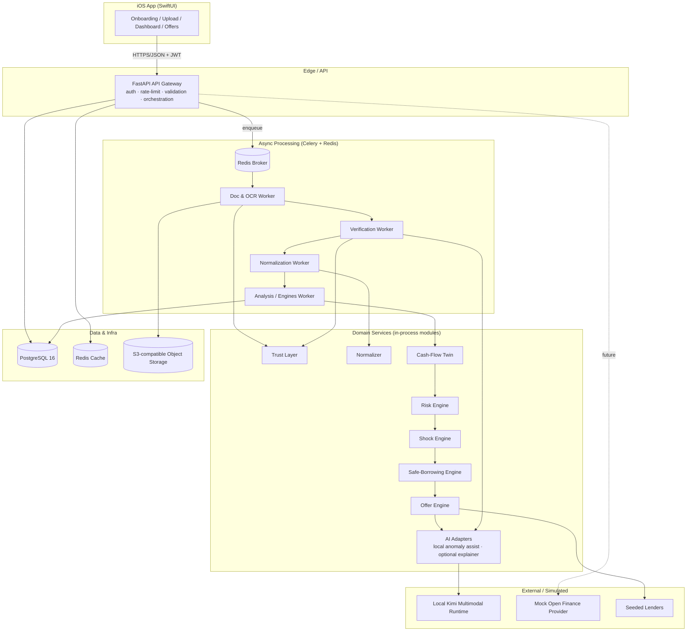
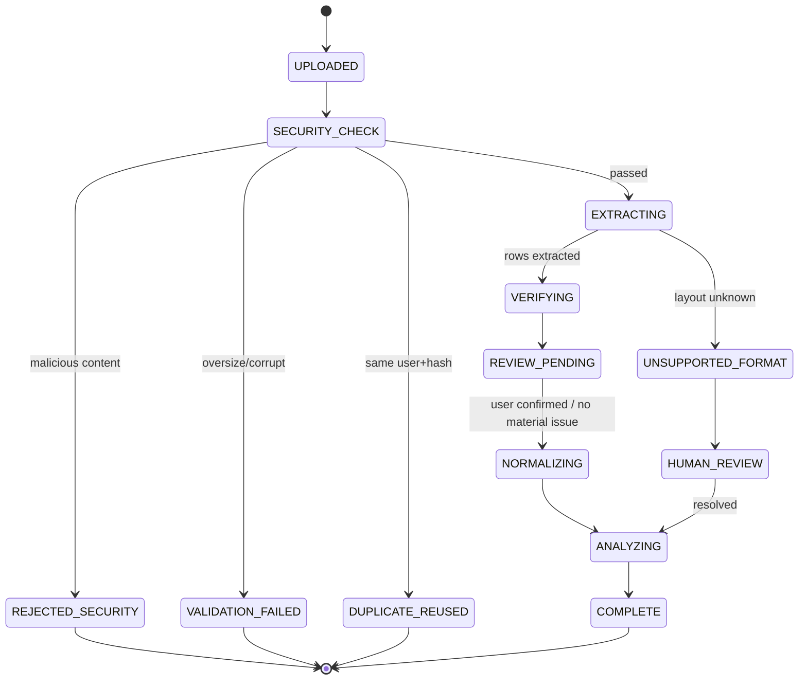
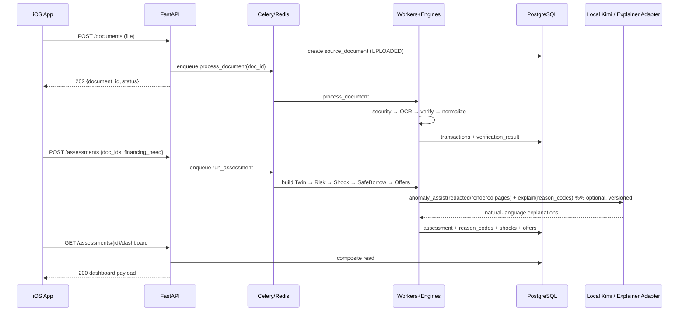
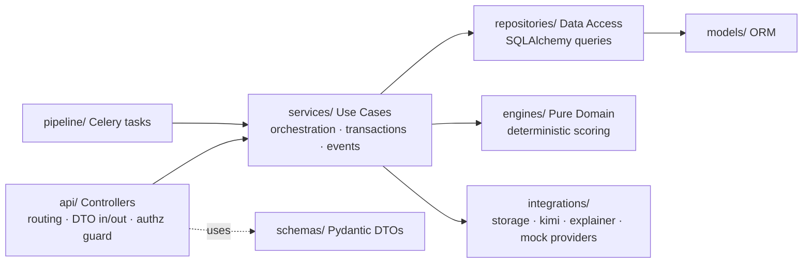
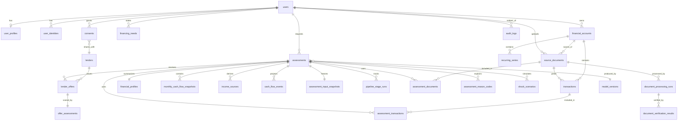

# PLAN.md — CrediWise Engineering Blueprint

> **Single Source of Truth.** This is the *only* document a coding agent is expected to read before implementing any feature in this repository. It is a hybrid **Product Requirements Document (PRD) + Technical Design Document (TDD)**. If a decision is not written here, it is either (a) not yet decided — raise it and update this file via the process in [§24 Coding Agent Instructions](#24-coding-agent-instructions), or (b) governed by the closest analogous decision already documented. **Do not invent architecture silently.**

- **Product:** CrediWise — *Two-Way Credit Safety Engine, Trust Layer & Open Finance Roadmap*
- **Document version:** `1.2.0`
- **Status:** Approved for Sprint 0
- **Last updated:** 2026-07-17
- **Approval note:** Native iOS, the full backend/worker infrastructure, and terminal-agent-driven parallel implementation are confirmed team decisions following mentor review.
- **Owner:** Founding engineering team
- **Change control:** See [§23 Decision Log](#23-decision-log) and [§24.11 Updating PLAN.md](#2411-how-to-update-planmd)

---

## Table of Contents

1. [Executive Summary](#1-executive-summary)
2. [Product Positioning & The Two-Way Model](#2-product-positioning--the-two-way-model)
3. [Personas, Roles & Permissions](#3-personas-roles--permissions)
4. [Product Requirements (Functional & Non-Functional)](#4-product-requirements)
5. [Business Rules & Scoring Logic](#5-business-rules--scoring-logic)
6. [MoSCoW Prioritization](#6-moscow-prioritization)
7. [Feature Catalogue (Detailed)](#7-feature-catalogue-detailed)
8. [System Architecture](#8-system-architecture)
9. [Technology Stack & Decision Log Summary](#9-technology-stack)
10. [Backend Architecture](#10-backend-architecture)
11. [Database Architecture & Schema](#11-database-architecture--schema)
12. [API Design](#12-api-design)
13. [iOS / Frontend Architecture](#13-ios--frontend-architecture)
14. [Design System](#14-design-system)
15. [The Analysis Pipeline (Engines)](#15-the-analysis-pipeline-engines)
16. [Third-Party Integrations](#16-third-party-integrations)
17. [Background Jobs, Caching, Storage, Config & Secrets](#17-background-jobs-caching-storage-config--secrets)
18. [Security Model & Threat Model](#18-security-model--threat-model)
19. [Model Governance, Audit & Fairness](#19-model-governance-audit--fairness)
20. [DevOps: Environments, CI/CD, Observability, Feature Flags](#20-devops-environments-cicd-observability-feature-flags)
21. [Testing Strategy](#21-testing-strategy)
22. [Coding Standards & Git Workflow](#22-coding-standards--git-workflow)
23. [Decision Log (ADRs)](#23-decision-log)
24. [Coding Agent Instructions](#24-coding-agent-instructions)
25. [Sprint-by-Sprint Roadmap](#25-sprint-by-sprint-roadmap)
26. [Master Implementation Checklist](#26-master-implementation-checklist)

---

## 1. Executive Summary

### 1.1 Vision

CrediWise is an **alternative financial-assessment platform** for underserved, thin-file, informal-income, freelance, gig-worker, and microbusiness (UMKM) users in Indonesia whose real financial capacity is invisible to conventional credit bureaus. It converts verified transaction data (bank e-statements, e-wallet histories, QRIS settlements, marketplace exports, CSV exports, and eventually Open Finance connections) into an **explainable** assessment of financial behaviour, repayment capacity, shock resilience, and *safe* borrowing capacity.

CrediWise is built on a **two-way credit-safety principle**. Conventional scoring asks *“Can this borrower safely repay the lender?”* CrediWise asks that **and** *“Can this borrower safely accept this loan without becoming financially vulnerable?”*

> **Defining principle:** *We do not only determine whether a user is creditworthy. We determine whether the credit is worthy of the user.*

### 1.2 Objectives

| # | Objective | How we measure it |
|---|-----------|-------------------|
| O1 | Prove that uploaded financial documents can be **verified** (not just parsed) | Data Confidence Score produced for ≥95% of well-formed uploads |
| O2 | Turn raw transactions into an **explainable financial profile** (Cash-Flow Digital Twin) | Twin generated with reason codes for every assessment |
| O3 | Demonstrate the **two-way** differentiator: score the *offer*, not just the borrower | Safe Offer Score computed per offer + safe-borrowing recommendation |
| O4 | Deliver a **polished, demo-ready iOS app** in hackathon timeframe | End-to-end demo flow (§1.6) runs on a physical device via TestFlight |
| O5 | Architect for **production readiness** without over-building the hackathon | Clean layering, migrations, tests, CI/CD from Sprint 0 |

### 1.3 Success Metrics

**Hackathon (MVP) success metrics**

- **Time-to-assessment:** upload → full dashboard in **< 30 s** for a digital PDF (< 90 s for a screenshot fallback).
- **Extraction accuracy:** ≥ 95% balance-reconstruction agreement on a *clean, digitally generated* statement fixture.
- **Explainability coverage:** 100% of scores (Data Confidence, Risk Band, Shock Resilience, Safe Offer) accompanied by ≥ 3 human-readable reason codes.
- **Demo reliability:** the scripted demo flow completes 10/10 runs without a manual restart.
- **Determinism:** identical input → identical scores (engines are pure/deterministic; LLM only phrases explanations).

**Post-MVP / production north-star metrics**

- **Predictive calibration** (after lender pilots): ROC-AUC, Brier score, calibration curve on real repayment outcomes.
- **Responsible-lending metric (North Star):** share of users steered *away* from offers exceeding their Safe Borrowing Capacity.
- **Fairness:** no systematic penalisation of irregular-but-predictable income segments (§19.4).

### 1.4 Assumptions (documented gaps → engineering decisions)

These are **reasonable engineering assumptions** made where the brief left gaps. They are binding until revised via the Decision Log.

- **A1 — Platform:** MVP client is a **native iOS app (SwiftUI)** per stakeholder preference. Android and a web lender console are post-MVP. See ADR-001.
- **A2 — Currency & locale:** Single currency **IDR (Rp)**, locale `id-ID`, all monetary values stored as **integer minor units is NOT used** — IDR has no commonly used subunit in practice; we store amounts as **`BIGINT` whole rupiah**. Timezone **Asia/Jakarta (WIB, UTC+7)**. See ADR-010.
- **A3 — MVP data source:** Uploaded documents only. Direct bank/e-wallet APIs and Open Finance are **simulated** (mock provider) in MVP. See §16.
- **A4 — Lenders:** Lender offers are **seeded/simulated** in MVP (no live lender integration). The lender dashboard is a **post-MVP web console**; in the MVP demo, lender-facing output is shown as a screen inside the app or a read-only web page.
- **A5 — Scoring models:** All borrower, affordability, resilience, and offer scores in MVP are **deterministic rule-based engines** with version-controlled weights, *not* trained ML models. Generative AI never invents or directly outputs these scores. A locally hosted Kimi-class vision-language model may produce a versioned **document anomaly signal** for fraud-assistance; it is evidence only and may affect Data Confidence only through an explicitly enabled, auditable model configuration (§15.3, §15.6, §19).
- **A6 — Identity/KYC:** Production KYC (liveness, e-KTP OCR, Dukcapil match) is **simulated**. MVP does name-matching against a self-declared profile.
- **A7 — Positioning:** MVP language is *“estimated financial-risk, affordability, and credit-readiness assessment”* — **never** “official credit score.” Enforced in copy constants (§14.6) and reviewed in every PR touching user-facing strings.
- **A8 — Compliance:** No real PII of real third parties is used in demos; only synthetic fixtures. Data-protection posture targets Indonesia's **UU PDP** principles (consent, minimisation, retention) as design guidance, not certified compliance.

### 1.5 Non-Goals (explicitly out of scope for the hackathon)

- We are **not** building a trained default-prediction ML model, a production fraud model, or a licensed PKA score.
- We are **not** integrating real bank/Open Finance production APIs, real lender APIs, or real disbursement/payments.
- We are **not** claiming regulatory recognition, PKA licensing, or bank acceptance.
- We are **not** shipping Android or a full multi-tenant lender SaaS console in MVP.
- We are **not** performing money movement of any kind (no transfers, no disbursement, no collection).

### 1.6 Expected Demo Scenario (the “golden path”)

```text
1.  User signs up / signs in (email + password), completes a 3-field profile.
2.  User states financing need: amount (e.g. Rp3,500,000), purpose (medical), preferred tenor.
3.  User uploads a bank e-statement PDF (fixture) — or a GoPay screenshot as fallback.
4.  Backend async pipeline: file security → OCR/extraction → deterministic PDF structural forensics → optional local Kimi anomaly assistance → Trust Layer verification.
5.  User reviews the extracted summary, confirms account ownership, and flags obvious extraction/category/internal-transfer errors without overwriting raw evidence.
6.  System freezes an immutable assessment-input snapshot. Data Confidence appears (e.g. 92/100 — High Confidence) with separate authenticity, extraction, consistency, coverage, freshness, and ownership signals.
7.  Dashboard shows Cash-Flow Digital Twin: personal vs business activity, income stability, essential vs discretionary spending, debt burden, recurring series, and weakest month.
8.  Indicative Credit Risk Band (e.g. B, Low-to-Moderate) with positive & risk factors.
9.  Safe Borrowing Capacity: max safe instalment, illustrative safe amount, tenor, preferred due date, and required liquidity buffer.
10. Shock simulations run on a temporal liquidity timeline (10/20/30% income drop, delayed income, emergency expense, source loss, weakest month) → Shock Resilience Score.
11. Three clearly labelled simulated lender offers appear; each gets a Safe Offer Score and refinancing-dependency check.
12. Offers are ranked by SAFETY (not commission). Safest is highlighted; dangerous offers are flagged.
13. User receives a deterministic Financial Health Summary and improvement plan, and can tap any warning for a plain-language explanation.
```

**Demo guardrail:** every screen must visibly reinforce “estimated assessment, not an official credit score” (footer disclaimer + positioning copy).

---

## 2. Product Positioning & The Two-Way Model

### 2.1 Core Positioning

CrediWise converts verified transaction data into: a **Data Confidence Score**, an explainable financial profile, an **Indicative Credit-Risk Band**, a **Shock Resilience Score**, a **Safe Borrowing Capacity**, a recommended repayment structure, and a **Safe Offer Score** for every offer. Unlike ordinary alternative scoring, **CrediWise scores the loan, not only the borrower.**

### 2.2 The Four Dimensions

| Dimension | Question it answers | Engine (§15) |
|-----------|--------------------|--------------|
| **Data Confidence** | Can the submitted financial data be trusted? | Trust Layer → Data Confidence Engine |
| **Credit Risk** | How reliable does repayment appear? | Indicative Risk Engine |
| **Shock Resilience** | Can the user keep paying essentials + instalments if things worsen? | Shock Simulation Engine |
| **Safe Borrowing Capacity** | What amount/instalment/tenor/date/frequency can they safely sustain? | Safe Borrowing Engine |

### 2.3 Positioning Guardrails (hard product constraints)

- **MUST** present outputs as *estimated financial-risk, affordability, and credit-readiness assessment*.
- **MUST NOT** claim an official, bank-recognised credit score or instruct lenders to approve based on an “official rating.”
- **MUST** keep **Data reliability separate from financial behaviour** — a low Data Confidence Score never means “dishonest user,” only “unverifiable data.”
- **MUST** keep the **lender responsible for the final decision**; CrediWise provides decision *support*, not decisions.
- These guardrails are enforced via (a) copy constants in the iOS `Strings` catalog, (b) a lint check that fails PRs containing banned phrases (`official credit score`, `guaranteed approval`) in user-facing strings, and (c) PR review checklist item (§22.7).

---

## 3. Personas, Roles & Permissions

### 3.1 Personas

- **P1 — Ibu Sari (Microbusiness / UMKM, QRIS seller):** irregular but predictable income; wants a productive loan without over-borrowing. Primary MVP persona.
- **P2 — Budi (Gig worker / freelancer):** multi-source income across bank + e-wallets; thin credit file. Primary MVP persona.
- **P3 — Rina (Lender analyst, regulated BPR):** needs a verified, explainable, auditable decision package. Post-MVP.
- **P4 — CrediWise Reviewer/Ops:** performs human review of low-confidence / borderline assessments. Post-MVP (stubbed in MVP).
- **P5 — CrediWise Admin:** manages model versions, feature flags, seeded lenders, and audit review. Post-MVP.

### 3.2 Roles & Permission Matrix

Roles are stored on the account and enforced by backend authorization (§18.3). MVP ships `USER` fully; other roles are scaffolded with stub screens/endpoints.

| Capability | USER | LENDER | REVIEWER | ADMIN |
|-----------|:----:|:------:|:--------:|:-----:|
| Manage own profile & consent | ✅ | — | — | ✅ |
| Upload documents / run assessment | ✅ | — | — | — |
| View own dashboard & offers | ✅ | — | — | — |
| Grant/revoke data-sharing consent | ✅ | — | — | ✅ |
| View a *consented* assessment package | — | ✅ (scoped) | ✅ | ✅ |
| Submit lender offers (seed) | — | ✅ | — | ✅ |
| Route/resolve human review | — | — | ✅ | ✅ |
| Manage model versions & feature flags | — | — | — | ✅ |
| View audit logs | own | own-access | scoped | all |

**Authorization principle:** *ownership + role + active consent*. A LENDER may only read a user's package if a valid, unexpired `consent` row grants that specific lender that specific scope (§11, §18.3).

---

## 4. Product Requirements

Requirements use IDs (`FR-*` functional, `NFR-*` non-functional) referenced by user stories, tests, and the checklist. Each functional requirement lists **Acceptance Criteria (AC)** in Given/When/Then form and key **Edge Cases (EC)**.

### 4.1 Functional Requirements

#### FR-1 — Account & Auth
User can register, log in, refresh session, and log out.
- **AC1:** *Given* valid email+password (≥10 chars, 1 letter + 1 number), *when* registering, *then* an account is created with role `USER` and a verification-pending identity status.
- **AC2:** *Given* valid credentials, *when* logging in, *then* an access token (15 min) and refresh token (30 d) are issued.
- **EC:** duplicate email → `409`; weak password → `422` with rule detail; expired refresh → `401` forcing re-login.

#### FR-2 — Onboarding & Financing Need
User completes profile and states financing need (amount, purpose, preferred tenor, urgency, employment/business type).
- **AC1:** financing need is persisted and attached to the next assessment.
- **AC2:** purpose is from an enum: `MEDICAL, EDUCATION, HOUSEHOLD_EMERGENCY, PRODUCTIVE_BUSINESS, EQUIPMENT, WORKING_CAPITAL, VEHICLE_DEVICE_REPAIR`.
- **EC:** requested amount ≤ 0 or absurdly large (> Rp1,000,000,000) → validation error.

#### FR-3 — Document Upload & File Security
User uploads one or more financial records (PDF/CSV/image). System performs file-security validation before processing.
- **AC1:** accepts `application/pdf`, `text/csv`, `image/png`, `image/jpeg`; rejects others with `415`.
- **AC2:** enforces max size (default **15 MB**, config `MAX_UPLOAD_MB`).
- **AC3:** computes SHA-256 file hash; a re-upload of the same hash by the same user returns the existing `source_document` (dedup) with a notice.
- **AC4:** password-protected PDFs use a transient-decryption flow: the password travels only over TLS, remains only in process memory, is never persisted/logged/queued, and decrypted temporary files are securely removed after processing.
- **AC5:** MIME type is validated using both declared type and magic bytes; filenames and storage keys are server-generated/sanitized; page-count, pixel-count, decompression-bomb, and OCR-time limits are enforced.
- **EC:** embedded scripts / suspicious PDF actions are quarantined (`REJECTED_SECURITY`); oversized/corrupt/zero-byte files are validation failures; duplicate uploads reuse the prior record and are never labelled a security rejection.

#### FR-4 — OCR & Transaction Extraction
System extracts structured transactions and statement metadata from the document.
- **AC1:** for explicitly supported, labelled MVP fixtures (initially one BCA-style digital statement and one GoPay-style image/export format), ≥95% field-level accuracy is achieved against golden expected outputs; unsupported layouts are never silently interpreted.
- **AC2:** extraction output conforms to the normalized intermediate schema (§15.2).
- **AC3:** OCR confidence is tracked at document/page/row/field levels; low-confidence rows are flagged, never silently dropped. Parser name, parser version, format-detection confidence, and processing-run ID are stored.
- **AC4:** extraction creates immutable raw evidence and a separate normalized representation; later corrections never overwrite source evidence.
- **EC:** image-only scanned PDF → OCR path with lower confidence; unsupported statement layout → `UNSUPPORTED_FORMAT` + review route; generic fallback may extract candidate rows but cannot mark them assessment-ready until schema and balance checks pass.

#### FR-5 — Trust Layer Verification & Data Confidence Score
System verifies metadata, balance consistency, provenance, visual authenticity, completeness, and account ownership, then produces a **Data Confidence Score (0–100)** with a band and reason codes.
- **AC1:** balance reconstruction runs (`Expected = Previous + Credits − Debits`); mismatched rows flagged.
- **AC2:** provenance classification maps source → base confidence tier (§5.2).
- **AC3:** score = weighted sum of 7 components (§5.2) → band `HIGH ≥80 / MEDIUM 50–79 / LOW <50`.
- **AC4:** result includes ≥3 reason codes and, when MEDIUM/LOW, an actionable recommendation (“upload original PDF / provide more months / connect account”).
- **AC5:** the UI and API expose separate subdimensions for source authenticity, file integrity, extraction quality, mathematical consistency, coverage, freshness, and account ownership.
- **AC6:** deterministic PDF structural forensics and the optional local Kimi anomaly signal remain separately attributable. Kimi cannot independently label a file fake or directly output the final score.
- **EC:** single-month upload may have high authenticity but low coverage; screenshot → provenance penalty; metadata missing → metadata penalty; **low confidence must not be phrased as fraud** (§2.3).

#### FR-6 — Normalization, Categorization & Detection
Transactions are normalized to a canonical schema, categorized, and enriched (internal-transfer detection, recurring detection, merchant normalization).
- **AC1:** all rows mapped to canonical `Transaction` (§11) with `category`/`subcategory`.
- **AC2:** internal transfers (own-account top-ups) flagged and excluded from income/expense aggregates.
- **AC3:** recurring income/expenses are detected via amount+interval+counterparty similarity.
- **AC4:** every transaction receives `transaction_context = PERSONAL | BUSINESS | MIXED | UNKNOWN`; UMKM categories include business revenue, QRIS/marketplace settlement, supplier payment, inventory, operating expense, owner draw, and household expense.
- **AC5:** multi-source detection links own-account transfers across bank/e-wallet/QRIS sources and excludes them from double-counted income/expense aggregates.
- **EC:** ambiguous category/context → `UNKNOWN` with low confidence (never guessed as income); duplicate/near-duplicate rows are linked to dedup evidence rather than destructively removed.

#### FR-7 — Cash-Flow Digital Twin
System computes the Twin: income stability, spending behaviour, cash-flow health, existing-debt burden, weakest month, buffers.
- **AC1:** produces summary metrics plus monthly cash-flow snapshots, income-source summaries, recurring series, business/personal splits, and temporal cash-flow events (§11).
- **AC2:** weakest-month metric = the historical month with the lowest post-essential free cash flow; daily/dated liquidity events are retained for due-date and delayed-income analysis.
- **AC3:** personal cash flow, business cash flow, combined cash flow, owner draws, business operating expenses, and source concentration are separately represented where inferable.
- **EC:** <2 months of data → Twin flagged `LOW_COVERAGE`, downstream model confidence reduced; uncertain business/personal classification remains `UNKNOWN` and is visible to the user.

#### FR-8 — Indicative Credit Risk & Repayment Capacity
System outputs an indicative risk band (A–D / Insufficient Data), a repayment-capacity result, model confidence, and reason codes.
- **AC1:** band derived from documented feature thresholds (§5.3), never from an LLM.
- **AC2:** model confidence is computed *separately* from the band (§5.5).
- **EC:** data confidence too low → band = `INSUFFICIENT_DATA`.

#### FR-9 — Safe Borrowing Capacity
System computes safe loan amount, maximum safe instalment, recommended tenor, preferred due date, and repayment frequency.
- **AC1:** safe instalment preserves a required liquidity buffer calculated from an absolute minimum, income ratio, essential-expense ratio, volatility adjustment, weakest-month survival, daily liquidity, and DSTI limits (§5.6).
- **AC2:** preferred due date is aligned to income-arrival timing.
- **EC:** free cash flow ≤ 0 → safe amount = Rp0 with an explanatory message (no loan is safe).

#### FR-10 — Shock Simulations & Resilience Score
System runs income-drop (10/20/30/custom), delayed-income, emergency-expense, income-source-loss, and weakest-month simulations against a proposed instalment; aggregates a **Shock Resilience Score (0–100)**.
- **AC1:** each scenario returns monthly and minimum-temporal projected balance, required-buffer breach, deficit amount, affordability status (`SURVIVABLE | STRAINED | DEFICIT`), and score contribution.
- **AC2:** the resilience score is reproducible for identical inputs.
- **EC:** custom shock parameters validated (0–100% for income drop; non-negative for emergency amount).

#### FR-11 — Offer Ingestion & Safe Offer Score
System ingests (seeded) lender offers and scores each with a **Safe Offer Score (0–100)**, total-cost breakdown, affordability, shock-testing, timing fit, and warning flags.
- **AC1:** offers ranked by **safety/suitability**, never by lender commission.
- **AC2:** dangerous offers (exceeding Safe Borrowing Capacity, deficit under moderate shock, unclear/high fees) produce explicit warnings.
- **AC3:** net cash received, principal, scheduled interest, financed/upfront fees, effective annual cost where computable, scheduled total repayment, and late-penalty terms are displayed separately.
- **AC4:** the engine evaluates refinancing/additional-borrowing dependency and remaining essential-expense coverage.
- **AC5:** every MVP offer is labelled `SIMULATED`; simulated providers use `SIMULATED_REGULATED_PROVIDER`, never an implied real endorsement.
- **EC:** offer missing fee disclosure → transparency penalty + warning; an offer that is normally payable but likely to require another loan receives `REFINANCING_DEPENDENCY_RISK`.

#### FR-12 — User Dashboard & Explainability
A single dashboard surfaces the four headline metrics + supporting analysis + reason codes + post-loan projection.
- **AC1:** four headline cards: Data Confidence, Risk Band, Shock Resilience, Safe Borrowing Capacity.
- **AC2:** every score is tappable → reason codes and methodology note.

#### FR-13 — Consent & Data Sharing
User controls which data is shared, with whom, for what purpose, and for how long; can revoke.
- **AC1:** creating a consent records scope, recipient, purpose, `granted_at`, `expires_at`.
- **AC2:** revocation immediately invalidates lender access (enforced at query time).
- **EC:** expired consent → lender read returns `403 CONSENT_EXPIRED`.

#### FR-14 — Extraction Review, Data Correction & Appeal
Before scoring, the user reviews an extracted summary and may flag incorrect values, categories, internal transfers, duplicates, missing rows, or ownership concerns.
- **AC1:** corrections are stored as `raw_extracted_value`, `system_normalized_value`, and `user_proposed_value`; raw evidence is immutable.
- **AC2:** the user confirms the review state before an assessment input snapshot is frozen.
- **AC3:** correction creates an auditable record; material changes may route to human review and trigger a new snapshot rather than mutate a completed assessment.

#### FR-15 — Audit & Model Governance
Every assessment records sources, confidence, model version, transformations, outputs, consent, and lender access; results are tied to a model version.
- **AC1:** an immutable `audit_logs` entry is written for every state-changing action.
- **AC2:** every score row references a `model_version`.

#### FR-16 — Lender Package (Post-MVP, scaffolded)
With active consent, a lender views a scoped, explainable, auditable decision package (identity/consent status, provenance, financial summary, risk, recommended structure, reason codes, audit).

#### FR-17 — Financial Health Summary & Improvement Plan
The system generates deterministic, evidence-backed recommendations selected from versioned rules; AI may phrase but not invent the underlying advice.
- **AC1:** recommendations map to reason codes and evidence, such as separating business/personal accounts, building a liquidity buffer, reducing BNPL/debt burden, changing repayment timing, or supplying more complete source data.
- **AC2:** every recommendation states why it applies and which metric would improve.

#### FR-18 — Immutable Assessment Lineage & Reproducibility
Each completed assessment is tied to exact documents, processing runs, verification results, normalized transaction hashes, accepted corrections, model configs, simulation parameters, and offer terms.
- **AC1:** re-running the same frozen snapshot with the same engine versions produces bit-identical outputs.
- **AC2:** later recategorization or parser upgrades cannot change a historical assessment; they require a new processing run/snapshot/assessment.

### 4.2 Non-Functional Requirements

| ID | Category | Requirement | Target |
|----|----------|-------------|--------|
| NFR-1 | Performance | Upload→dashboard latency (digital PDF) | p50 < 15 s, p95 < 30 s |
| NFR-2 | Performance | Sync API endpoints (non-pipeline) | p95 < 400 ms |
| NFR-3 | Reliability | Pipeline is idempotent & resumable per stage | Re-running a stage yields identical output |
| NFR-4 | Determinism | Engines are pure functions of (transactions, config, model_version) | Bit-identical scores on identical input |
| NFR-5 | Security | All PII & documents encrypted at rest; TLS in transit | AES-256 at rest, TLS 1.2+ |
| NFR-6 | Security | Bank passwords / provider credentials never stored | Enforced; only OAuth tokens (post-MVP), encrypted |
| NFR-7 | Privacy | Data minimisation + retention limits + deletion workflow | Retention config; hard-delete job |
| NFR-8 | Availability | MVP demo uptime during judging window | Best-effort single-region; health checks |
| NFR-9 | Scalability | Horizontal scale of API and workers | Stateless API, queue-based workers |
| NFR-10 | Observability | Structured logs, error tracking, request tracing | JSON logs + Sentry + correlation IDs |
| NFR-11 | Accessibility (iOS) | Dynamic Type, VoiceOver labels, ≥ 4.5:1 contrast | Audited on headline screens |
| NFR-12 | Localization | `id-ID` primary, `en` fallback; all copy externalised | No hard-coded user strings |
| NFR-13 | Maintainability | Layered architecture, ≥ 70% backend test coverage on engines | Enforced in CI |
| NFR-14 | Auditability | Immutable audit trail + model versioning | Append-only `audit_logs` |
| NFR-15 | Portability | Cloud-agnostic (Docker, S3-compatible storage, managed Postgres) | No hard vendor lock-in in core |
| NFR-16 | AI privacy | Fraud-assistance model runs locally/self-hosted; no raw statements leave controlled infrastructure for anomaly detection | Kimi adapter defaults to local inference |
| NFR-17 | Reproducibility | Completed assessments reference immutable input snapshots and exact parser/engine/model hashes | Historical outputs never drift |

### 4.3 Constraints & Dependencies

- **C1:** iOS 16+ (SwiftUI, Swift Concurrency, Charts framework).
- **C2:** Backend Python 3.12; PostgreSQL 16; Redis 7.
- **C3:** AI dependencies are separated: (a) a **local/self-hosted Kimi-class multimodal model** for optional document anomaly assistance, and (b) an optional explanation provider behind an adapter. Both degrade gracefully; deterministic templates remain the required fallback. Raw statements must not be sent to a third-party explanation service.
- **C4:** OCR dependency = pdfplumber/PyMuPDF (digital) + Tesseract/vision (image); must not block the whole pipeline if one path fails (per-document status).
- **C5:** Object storage = S3-compatible (Cloudflare R2 / AWS S3 / MinIO local).
- **C6:** No real financial-institution or lender production credentials in any environment.

### 4.4 Future Extensibility Hooks (design now, build later)

- Pluggable **provenance/source adapters** so a future Open Finance/aggregator source drops into the same `Transaction` schema.
- **Engine versioning** so trained ML models can replace rule-based engines behind the same interface without changing callers.
- **Consent scopes** modelled generically (`data_scope_json`) to support fine-grained field-level sharing later.
- **Multi-account aggregation** built in from day one (user → many `financial_accounts` → many documents/transactions).

---

## 5. Business Rules & Scoring Logic

> **All scoring is deterministic and version-controlled.** Weights and thresholds below are **MVP defaults** and are stored in a versioned config module (`app/engines/config/model_config.py`) keyed by `model_version`. Changing any number here = a new model version (§19.2). The LLM never produces a number; it only phrases the *why*.

### 5.1 Global Money & Rounding Rules

- All monetary amounts are **whole IDR** stored as `BIGINT` (ADR-010). No fractional rupiah.
- Ratios computed in `Decimal` (28-digit context), rounded **half-up** to 2 dp for display, but full precision retained in stored `*_score` fields (stored as `NUMERIC(6,2)`).
- Scores are integers 0–100 for display; internally `NUMERIC(6,2)` to allow deterministic aggregation before final rounding.

### 5.2 Data Confidence Score (Trust Layer)

**Weighted model (v1):**

| Component | Weight | Source signal |
|-----------|:-----:|---------------|
| Source provenance | 20% | source tier table below |
| Balance consistency | 20% | % of rows passing balance reconstruction |
| Metadata integrity | 15% | creation/mod dates, producer, signature, incremental edits |
| OCR quality | 15% | mean row `extraction_confidence` |
| Visual/structural consistency | 10% | anomaly indicators (fonts, overlays, alignment) |
| Completeness / coverage | 10% | months covered vs required (target 6) |
| Account-ownership confidence | 10% | name/account match vs profile |

**Provenance tiers (base sub-score for the provenance component):**

| Source | Base |
|--------|:----:|
| Direct bank/e-wallet API (future) | 100 |
| Digitally signed statement | 90 |
| Original PDF statement | 78 |
| Exported CSV | 65 |
| Screenshot | 45 |
| Photo of a screen | 30 |

**Bands:** `HIGH ≥ 80`, `MEDIUM 50–79`, `LOW < 50`.
**Rule:** source-integrity subscore may reach 100 for authenticated API data, while overall Data Confidence remains the weighted result of integrity, completeness, freshness, ownership, and other components; no artificial 99-point cap is used.
**Rule:** LOW/MEDIUM never worded as “fake”; always paired with an improvement recommendation.

### 5.3 Indicative Credit Risk Band

Computed from four feature groups (income, cash-flow, obligations, behaviour). Each feature is scored to a 0–100 sub-score against documented thresholds; the weighted composite maps to a band. **Defaults (v1):**

- Income stability **30%**, Cash-flow health **30%**, Obligation load **25%**, Financial behaviour **15%**.
- **Debt-service-to-income (DSTI)** thresholds: `≤20% excellent, ≤35% good, ≤45% caution, >45% high`.
- **Positive-cash-flow-month ratio:** `≥0.8 strong, 0.6–0.79 ok, <0.6 weak`.
- **Income-source concentration:** single-source dependency > 80% → risk flag (but *not* auto-penalised for predictable seasonality — see fairness §19.4).

**Band mapping (composite → band):** `A ≥ 80`, `B 65–79`, `C 50–64`, `D < 50`. If Data Confidence band = LOW **or** coverage < 2 months → **`INSUFFICIENT_DATA`** regardless of composite.

### 5.4 Repayment Capacity

`FreeCashFlow = MedianIncome − EssentialExpenses − ExistingDebtService`. The result reports not just feasibility but **remaining buffer** after a proposed instalment. Weakest-month free cash flow is reported alongside the average.

### 5.5 Model Confidence (separate from band)

Function of: months available, completeness, source reliability, ownership confidence, OCR quality, anomaly level, missing periods. Bands: `HIGH / MEDIUM / LOW`. **Rule (NFR/FR-8):** a low-risk result derived from thin data must be shown with reduced model confidence — never “high confidence.”

### 5.6 Safe Borrowing Capacity

The primary offer-independent output is **Maximum Safe Instalment**. Safe principal is derived only after tenor, repayment schedule, fees, and financing cost are known.

```text
RequiredLiquidityBuffer = max(
  MIN_ABSOLUTE_BUFFER_IDR,
  MedianIncome × INCOME_BUFFER_RATIO,
  EssentialExpenses × ESSENTIAL_BUFFER_RATIO,
  VolatilityBuffer
)

BaseCapacity = max(0, MedianIncome − EssentialExpenses − ExistingDebtService − RequiredLiquidityBuffer)
MaximumSafeInstalment = min(BaseCapacity, DSTICapacity, WeakestMonthCapacity, TemporalLiquidityCapacity, ShockCapacity)
```

MVP defaults live in model config and are assumptions, not universal financial advice. `VolatilityBuffer` increases with income/cash-flow volatility. `TemporalLiquidityCapacity` ensures the instalment does not create a due-date deficit before income arrives. `ShockCapacity` is the highest instalment that remains at least `STRAINED`, not `DEFICIT`, under the configured moderate shock.

- **Recommended tenor:** candidate set `{6, 9, 12}` months; choose the shortest tenor whose complete payment schedule fits Maximum Safe Instalment and required buffer.
- **Illustrative safe principal:** calculated using the configured reference financing assumptions and labelled *illustrative*. It must specify amortisation method, rate basis, fee treatment, payment frequency, and rounding.
- **Actual offer capacity:** always recalculated from the offer's actual schedule, net disbursement, fees, and effective cost.
- **Preferred due date:** begins several days after a high-confidence income event and is validated on the temporal liquidity timeline.
- **Rule:** if free cash flow ≤0 or the moderate-shock capacity is zero, safe amount = Rp0 with explanation.

### 5.7 Loan Mathematics Contract

Every loan calculation must store and expose: principal, **net amount received**, nominal/flat rate if supplied, effective annual rate where computable, amortisation method (`FLAT | REDUCING_BALANCE | FIXED_SCHEDULE`), payment frequency, payment schedule, scheduled interest, upfront fees, financed fees, total scheduled repayment, and penalty terms.

- Whole-rupiah rounding is half-up at each scheduled payment only when required by the contract; internal calculations retain Decimal precision.
- Late penalties are disclosed but excluded from normal scheduled instalments.
- The MVP reference assumption may remain 24%/year, but output must read: **“Illustrative principal under configured reference cost; not a guaranteed borrowing limit.”**

### 5.8 Shock Resilience Score

The Shock Engine operates on both monthly aggregates and a dated/day-of-month liquidity timeline. Default scenarios:

| Scenario | Default weight |
|----------|:-------------:|
| 10% income drop | 10% |
| 20% income drop | 20% |
| 30% income drop | 10% |
| Delayed dominant income event | 15% |
| Emergency expense (Rp1,000,000) | 15% |
| Largest income-source loss | 10% |
| Weakest-month replay | 20% |

Outcome definitions:
- `SURVIVABLE`: minimum projected balance ≥ required liquidity buffer.
- `STRAINED`: minimum projected balance ≥ 0 but below required buffer.
- `DEFICIT`: minimum projected balance < 0.

Full points / half points / zero points apply respectively unless a model version specifies a graduated curve. Bands: `STRONG ≥75`, `MODERATE 50–74`, `FRAGILE <50`.

### 5.9 Safe Offer Score

| Factor | Weight | Rule |
|--------|:-----:|------|
| Instalment affordability & remaining buffer | 20% | respects Maximum Safe Instalment and essential coverage |
| Within illustrative/actual safe principal | 15% | evaluated using actual offer schedule |
| Shock survivability | 20% | key shocks rerun with offer payment events |
| Total/effective cost & net proceeds | 15% | considers cash actually received, not nominal principal alone |
| Fee/penalty transparency | 10% | missing/unclear terms penalised and flagged |
| Timing fit | 5% | due date aligned to income and daily liquidity |
| Refinancing-dependency risk | 10% | likelihood of needing new borrowing for essentials/debt |
| Provider verification status | 5% | verified regulated > unverified; MVP providers explicitly simulated |

Bands: `SAFE ≥75`, `CAUTION 50–74`, `UNSAFE <50`. Ranking is score descending, then lower effective total cost. Commission is never an input. Reason code `REFINANCING_DEPENDENCY_RISK` is required when normal affordability masks inadequate volatility/emergency buffer.

### 5.10 Human-Review Routing Rules (stub in MVP)


Route to review when: Data Confidence LOW; identity uncertain; unsupported format; unusual behaviour; result within ±3 points of a band threshold; user disputes categorization; model confidence LOW.

---

## 6. MoSCoW Prioritization

### 6.1 Must Have (MVP — the golden path in §1.6)

- Email/password auth (register/login/refresh/logout), `USER` role.
- Onboarding profile + financing-need capture.
- Document upload (PDF/CSV/image) + file-security validation + hashing/dedup.
- OCR/extraction for **digital PDFs** (primary) + screenshot fallback path.
- Trust Layer: balance reconstruction, metadata check, provenance, completeness, ownership → **Data Confidence Score** + reason codes.
- Normalization, categorization, internal-transfer & recurring detection.
- **Cash-Flow Digital Twin** + personal/business split, monthly snapshots, recurring series, income-source summaries, and temporal liquidity events.
- **Indicative Risk Band** + repayment capacity + model confidence + reason codes.
- **Safe Borrowing Capacity** (amount, instalment, tenor, due date, frequency).
- **Shock simulations** + **Shock Resilience Score**.
- **Seeded lender offers** + **Safe Offer Score** + safety ranking + dangerous-offer explanations.
- **User dashboard** (4 headline cards + supporting analysis + explainability) plus deterministic Financial Health Summary and Improvement Plan.
- Immutable assessment snapshots, many-to-many document/transaction lineage, processing-stage records, and versioned extraction/verification runs.
- Positioning disclaimers everywhere; deterministic engines; audit logging; model versioning tag.

### 6.2 Should Have (post-MVP foundation)

- Consent creation/revocation UI + enforcement.
- Multi-document / multi-month aggregation and cross-source consistency are implemented in the MVP golden path for the explicitly supported fixture formats.
- Extraction review, user confirmation, and auditable correction flow are implemented before scoring.
- LLM-generated natural-language explanations (behind a flag; templated fallback is Must-Have).
- CSV import path hardening; QRIS/marketplace export parsers.
- Basic reviewer/admin stub screens.

### 6.3 Could Have (stretch)

- Lender web console (read-only decision package).
- Push notifications (assessment ready, consent expiring).
- PDF export of the assessment package.
- Offer comparison saved states / history.
- Localization polish (full `id-ID`), dark mode.

### 6.4 Won't Have (this hackathon — explicit)

- Real bank / Open Finance / aggregator production integrations.
- Real lender APIs / disbursement / payments / collections.
- Trained ML default-risk / fraud models; official credit score; PKA licensing.
- Android app; full multi-tenant lender SaaS; production KYC/liveness.
- Any real money movement.

---

## 7. Feature Catalogue (Detailed)

Each feature: **Purpose · Business value · Primary user story · Key APIs · Data models · UI screens · Permissions · Validations · Edge/failure cases · Future**. MVP scope tagged `[MVP]`, else `[POST-MVP]`.

### 7.1 `[MVP]` Onboarding, Auth & Financing Need
- **Purpose:** create an account and capture what the user wants to borrow and why.
- **Value:** anchors the assessment to a concrete need; enables affordability framing.
- **Story:** *As a gig worker, I want to sign up and say I need Rp3.5M for a medical emergency, so the assessment is tailored to that request.*
- **APIs:** `POST /auth/register`, `POST /auth/login`, `POST /auth/refresh`, `POST /auth/logout`, `PATCH /me/profile`, `POST /financing-needs`.
- **Models:** `users`, `user_profiles`, `financing_needs`.
- **Screens:** Welcome, Sign up, Sign in, Profile setup, Financing-need form.
- **Permissions:** public (auth), `USER` (profile/need).
- **Validations:** email format, password policy, purpose enum, amount range (Rp0 < x ≤ Rp1B), tenor 1–36.
- **Edge/failure:** duplicate email `409`; token expiry `401`; offline → local draft of financing need, sync on reconnect.
- **Future:** e-KTP OCR + liveness; social login.

### 7.2 `[MVP]` Document Upload & File Security
- **Purpose:** ingest financial records safely.
- **Value:** the raw material for everything; security prevents malicious/duplicate inputs.
- **Story:** *As a user, I upload my BCA e-statement PDF and get told it was received and is being verified.*
- **APIs:** `POST /documents` (multipart or presigned-URL flow), `GET /documents/{id}/status`.
- **Models:** `financial_accounts`, `source_documents`.
- **Screens:** Upload picker, per-file progress, security-error state.
- **Permissions:** `USER` (own).
- **Validations:** MIME + magic-bytes, size ≤ `MAX_UPLOAD_MB`, PDF password handling, SHA-256 dedup, embedded-script scan.
- **Edge/failure:** encrypted PDF without password → prompt; malicious content → `REJECTED_SECURITY`; duplicate → return existing doc.
- **Future:** direct API/Open Finance connect replaces upload.

### 7.3 `[MVP]` OCR & Extraction
- **Purpose:** turn documents into normalized transaction rows + statement metadata.
- **Value:** structured data is prerequisite to all analysis.
- **APIs:** internal pipeline stage (triggered by upload); `GET /documents/{id}/transactions`.
- **Models:** `source_documents`, `transactions` (raw→normalized), `document_verification_results`.
- **Screens:** processing state; extracted-transactions review (Should-Have edit).
- **Validations:** per-row confidence, schema conformance.
- **Edge/failure:** scanned/image PDF → OCR fallback; unsupported layout → `UNSUPPORTED_FORMAT` + review route.
- **Future:** provider-specific templates; layout ML.

### 7.4 `[MVP]` Trust Layer & Data Confidence
- **Purpose:** decide whether the data can be trusted; quantify it.
- **Value:** the credibility gate that separates CrediWise from “parse-and-pray” tools.
- **APIs:** `GET /documents/{id}/verification`, surfaced in `GET /assessments/{id}/dashboard`.
- **Models:** `document_verification_results`.
- **Screens:** Data Confidence card + drill-down (reason chips, recommendations).
- **Validations:** balance reconstruction, metadata, provenance, completeness, ownership, visual anomalies.
- **Edge/failure:** low confidence → clear, non-accusatory messaging + how to improve.
- **Future:** vision-model anomaly detection; signed-statement verification.

### 7.5 `[MVP]` Normalization, Categorization & Detection
- **Purpose:** canonicalise and enrich transactions.
- **APIs:** internal; `GET /transactions?assessment_id=`.
- **Models:** `transactions`, `recurring_series` (derived, optional table or computed).
- **Validations:** category enum, internal-transfer exclusion, dedup.
- **Edge/failure:** unknown category kept as `UNKNOWN` (never assumed income).
- **Future:** ML categorizer; merchant-graph normalization.

### 7.6 `[MVP]` Cash-Flow Digital Twin
- **Purpose:** structured mathematical model of the user's financial life.
- **APIs:** produced during assessment; `GET /assessments/{id}/twin`.
- **Models:** `financial_profiles`.
- **Screens:** Twin summary (income stability, essential vs discretionary, debt, weakest month).
- **Edge/failure:** low coverage → `LOW_COVERAGE` flag.

### 7.7 `[MVP]` Indicative Risk & Repayment Capacity
- **APIs:** `POST /assessments`, `GET /assessments/{id}`.
- **Models:** `assessments`, `assessment_reason_codes`.
- **Screens:** Risk band card + positive/risk factors + model confidence.
- **Edge/failure:** insufficient data → `INSUFFICIENT_DATA`.

### 7.8 `[MVP]` Safe Borrowing Capacity
- **APIs:** `GET /assessments/{id}/recommendation`.
- **Models:** fields on `assessments`.
- **Screens:** Safe-borrowing card (amount, instalment, tenor, due date, frequency) + post-loan projection.

### 7.9 `[MVP]` Shock Simulations & Resilience
- **APIs:** `POST /assessments/{id}/simulate` (parameterised), `GET /assessments/{id}/shocks`.
- **Models:** `shock_scenarios`.
- **Screens:** Shock Resilience card + interactive sliders (income-drop %, emergency amount).
- **Edge/failure:** invalid params `422`.

### 7.10 `[MVP]` Offers & Safe Offer Score
- **APIs:** `POST /assessments/{id}/offers` (seed/simulate), `GET /assessments/{id}/offers`, `GET /offers/{id}/safety`.
- **Models:** `lender_offers`, `offer_assessments`, `lenders`.
- **Screens:** Offer list (ranked, colour-coded), offer detail, dangerous-offer explanation.
- **Edge/failure:** offer exceeding capacity → warning; missing fees → transparency penalty.

### 7.11 `[MVP]` User Dashboard & Explainability
- **APIs:** `GET /assessments/{id}/dashboard` (composite read).
- **Screens:** Dashboard (4 cards), each tappable to reasons + methodology.

### 7.12 `[POST-MVP]` Consent & Data Sharing
- **APIs:** `POST /consents`, `GET /consents`, `DELETE /consents/{id}`.
- **Models:** `consents`.
- **Screens:** Consent dashboard, grant/revoke sheet.
- **Edge/failure:** expired/revoked → lender read `403`.

### 7.13 `[POST-MVP]` Data Correction & Appeal
- **APIs:** `POST /transactions/{id}/corrections`, `POST /assessments/{id}/appeals`.
- **Models:** `corrections`, `review_tasks`.

### 7.14 `[POST-MVP]` Lender Package & Console
- **APIs:** `GET /lender/assessments/{id}` (consent-scoped).
- **Screens:** (web) identity/consent, provenance, financial summary, risk, recommended structure, reason codes, audit.

### 7.15 `[MVP]` Audit & Model Governance
- **APIs:** `GET /audit/user-access`.
- **Models:** `audit_logs`, `model_versions`.
- **Screens:** (user) “Who accessed my data”; (admin post-MVP) model registry.

---

## 8. System Architecture

### 8.1 High-Level Architecture



### 8.2 Processing-Pipeline State Machine

Each `source_document` and each `assessment` advances through explicit states (persisted, resumable, idempotent per stage — NFR-3).



### 8.3 Assessment Sequence (happy path)



### 8.4 Repository Layout (monorepo)

```text
crediwise/
├── PLAN.md                      # THIS FILE — single source of truth
├── docs/
│   ├── adr/                     # Architecture Decision Records (ADR-XXX.md)
│   ├── api/                     # generated OpenAPI snapshots
│   └── fixtures/                # synthetic statements & expected outputs
├── backend/
│   ├── app/
│   │   ├── main.py              # FastAPI app factory
│   │   ├── core/                # config, security, logging, deps, errors
│   │   ├── api/                 # routers (controllers) v1/
│   │   ├── schemas/             # Pydantic request/response DTOs
│   │   ├── services/            # application/use-case layer
│   │   ├── repositories/        # data-access layer (SQLAlchemy)
│   │   ├── models/              # SQLAlchemy ORM entities
│   │   ├── engines/             # PURE deterministic engines + model_config
│   │   ├── pipeline/            # Celery tasks + stage orchestration
│   │   ├── integrations/        # kimi/, storage/, mock_openfinance/
│   │   └── db/                  # session, base, migrations bootstrap
│   ├── alembic/                 # migrations
│   ├── tests/                   # unit/integration/e2e
│   ├── pyproject.toml
│   └── Dockerfile
├── ios/
│   └── CrediWise/               # SwiftUI app (see §13)
├── infra/
│   ├── docker-compose.yml       # local: api, worker, postgres, redis, minio
│   └── github-actions/          # CI workflows
└── Makefile                     # dev shortcuts
```

---

## 9. Technology Stack

> Full rationale in the Decision Log (§23). Summary here.

| Layer | Choice | Why (vs alternatives) |
|-------|--------|------------------------|
| iOS client | **SwiftUI (iOS 16+)**, Swift Concurrency, Swift Charts, SPM | Stakeholder preference; native performance; Charts for financial viz. Alt: React Native (rejected — weaker native feel, no stakeholder pref). |
| Backend | **Python 3.12 + FastAPI** | Best ecosystem for OCR/finance/LLM; Pydantic validation; async-capable; team ML familiarity. Alt: Node/Nest (weaker data/OCR libs), Go (fast but poor OCR/DS ecosystem). |
| ORM/DB access | **SQLAlchemy 2.0 (sync) + Alembic** | Mature, explicit, migration-first. Sync chosen for one uniform session pattern across API (threadpool) and Celery workers — simpler for agents (ADR-004). |
| Database | **PostgreSQL 16** | ACID, JSONB for flexible reason/scope payloads, strong indexing. Alt: Mongo (rejected — relational integrity matters for financial audit). |
| Cache & broker | **Redis 7** | Celery broker + response/idempotency cache + rate-limit store. |
| Async jobs | **Celery** | Battle-tested, well-documented for agents; explicit task graph. Alt: ARQ (async-native, lighter) noted as future option (ADR-004). |
| OCR/extraction | **pdfplumber + PyMuPDF (digital), Tesseract (image)** | Digital-first is fast and deterministic; OCR handles image fallbacks. |
| Local multimodal AI | **Self-hosted Kimi-class model behind an OpenAI-compatible adapter** | Optional document anomaly assistance without sending statements to an external provider; evidence is versioned and bounded (ADR-006). |
| Explanation AI | **Provider-neutral adapter; deterministic templates required** | May phrase reason codes; cannot invent scores/recommendations; raw statements are not sent externally. |
| Object storage | **S3-compatible** (Cloudflare R2 / AWS S3 / MinIO local) | Cheap, portable, no lock-in (NFR-15). |
| Auth | **Custom JWT (access+refresh), argon2id** | Full control over RBAC + consent model; no vendor lock. Alt: Supabase/Auth0 (faster but less control over consent-scoped authz) (ADR-003). |
| Secrets | `.env` (local) + platform secret store / Doppler (prod) | Never in VCS. |
| Deploy | Backend on **Render/Railway/Fly** (Docker); Postgres/Redis managed; iOS via **TestFlight** | Hackathon speed + prod-capable. |
| CI/CD | **GitHub Actions** | Lint, test, build, migrate, deploy. |
| Observability | **Sentry + structured JSON logs + correlation IDs**; PostHog (optional analytics) | Errors + traceability. |

---

## 10. Backend Architecture

### 10.1 Clean Layered Design

Strict dependency direction: **API → Services → Repositories → Models/DB**. **Engines are pure** and depend on nothing but their inputs and `model_config`. No layer skips downward-only rules; upward imports are forbidden.



**Layer responsibilities**

- **`api/` (controllers):** HTTP only — parse/validate DTOs, apply auth guards (§18.3), call one service method, map to response DTO, translate exceptions to HTTP. **No business logic, no DB queries.**
- **`services/` (use cases):** orchestration, transaction boundaries (`with uow:`), emit domain events (audit), call repositories + engines + integrations. **No SQL text, no HTTP objects.**
- **`repositories/`:** all persistence; return ORM entities or typed rows. One repository per aggregate. **No business rules.**
- **`engines/`:** pure functions `(inputs, model_config) -> result`. **No I/O, no DB, no clock/random unless injected.** This is what makes scores deterministic and testable (NFR-4).
- **`integrations/`:** side-effectful adapters (storage, local Kimi, optional explainer, mock bank). Behind interfaces so they're swappable/mocked.
- **`pipeline/`:** Celery tasks that sequence services across the state machine (§8.2); idempotent, resumable.

### 10.2 Dependency Injection

FastAPI `Depends` for request-scoped deps: DB session, current user, repositories, unit-of-work. A single **Unit of Work** wraps a DB transaction per request/task; services commit/rollback explicitly. Engines receive plain data (never a session).

### 10.3 Error Handling

- Central exception hierarchy in `core/errors.py`: `CrediWiseError` → `NotFoundError`, `ValidationError`, `AuthError`, `PermissionError`, `ConflictError`, `PipelineError`, `IntegrationError`.
- A FastAPI exception handler maps each to a **stable error envelope**:
  ```json
  { "error": { "code": "CONSENT_EXPIRED", "message": "...", "details": {}, "correlation_id": "..." } }
  ```
- Engines never raise HTTP; they raise domain errors or return typed results with `status` fields.
- Every response carries an `X-Correlation-Id`; logged with every log line (NFR-10).

### 10.4 Transactions & Idempotency

- **Write endpoints** run in one DB transaction (UoW). Partial pipeline stages persist their own committed checkpoints so re-runs are safe (NFR-3).
- **Idempotency keys:** upload dedup via file hash; assessment creation accepts an `Idempotency-Key` header (stored in Redis 24h) to avoid duplicate assessments on retries.

### 10.5 Events & Audit

- Services emit lightweight domain events (`DocumentVerified`, `AssessmentCompleted`, `ConsentGranted/Revoked`, `LenderAccessedPackage`).
- A single audit subscriber writes append-only `audit_logs` rows. Audit writes are best-effort-but-guaranteed within the same transaction as the state change (FR-15).

---

## 11. Database Architecture & Schema

### 11.1 Conventions (apply to EVERY table)

- **Primary keys:** `id UUID DEFAULT gen_random_uuid()` (pgcrypto). No auto-increment ints exposed.
- **Audit fields:** `created_at TIMESTAMPTZ NOT NULL DEFAULT now()`, `updated_at TIMESTAMPTZ NOT NULL DEFAULT now()` (trigger-updated).
- **Soft delete:** `deleted_at TIMESTAMPTZ NULL`. All default queries filter `deleted_at IS NULL`. Hard-delete only via the retention/erasure job (§17.4, NFR-7).
- **Money:** `BIGINT` whole IDR. **Scores:** `NUMERIC(6,2)`. **Ratios:** `NUMERIC(6,4)`.
- **Flexible payloads:** `JSONB` (`flags_json`, `reason` evidence, `data_scope_json`, `metadata_json`).
- **Timestamps:** always `TIMESTAMPTZ`; app timezone Asia/Jakarta but stored UTC.
- **FKs:** `ON DELETE RESTRICT` for financial lineage (never cascade-destroy audit trail); junction/config tables may cascade.
- **Enums:** Postgres native `ENUM` types for closed sets (status, category, band, role).
- **Indexes:** every FK indexed; plus composite/partial indexes listed per table.
- **Encryption:** field-level encryption (app-layer, `core/crypto.py`) for `document_number_hash` inputs, and any stored access tokens (post-MVP). Documents themselves live in object storage, encrypted at rest.

### 11.2 Entity–Relationship Diagram



### 11.3 Table Definitions

> Only non-obvious columns and all keys/indexes/constraints are called out. `id`, `created_at`, `updated_at`, `deleted_at` are implied on every table per §11.1.

**`users`** — auth principal.
`email CITEXT UNIQUE NOT NULL`, `password_hash TEXT NOT NULL` (argon2id), `role role_enum NOT NULL DEFAULT 'USER'`, `identity_status identity_status_enum NOT NULL DEFAULT 'UNVERIFIED'`, `phone TEXT`, `last_login_at TIMESTAMPTZ`.
Index: `UNIQUE(email) WHERE deleted_at IS NULL`.

**`user_profiles`** — 1:1 profile.
`user_id FK→users UNIQUE`, `full_name TEXT`, `employment_type employment_enum`, `business_type TEXT`, `locale TEXT DEFAULT 'id-ID'`.

**`user_identities`** — KYC records (simulated MVP).
`user_id FK`, `document_type doc_type_enum`, `document_number_hash TEXT` (encrypted/hashed), `verified_name TEXT`, `verification_status verify_status_enum`, `verification_provider TEXT`, `verified_at TIMESTAMPTZ`.

**`refresh_tokens`** — server-side hashed, revocable sessions (§18.1; added in Sprint 1/T1.2, not originally listed here — §24.11).
`user_id FK`, `token_hash CHAR(64)` (SHA-256 of the opaque refresh token; the raw token is never stored), `expires_at TIMESTAMPTZ`, `revoked_at TIMESTAMPTZ NULL`, `replaced_by_token_id FK→refresh_tokens NULL` (rotation chain — `/auth/refresh` issues a new token and revokes the old one).
Index: `(user_id)`, `UNIQUE(token_hash) WHERE deleted_at IS NULL`.

**`financial_accounts`** — a user's bank/e-wallet/QRIS/marketplace account.
`user_id FK`, `account_type account_type_enum` (`BANK, EWALLET, QRIS, MARKETPLACE`), `provider_name TEXT`, `masked_account_number TEXT`, `ownership_status ownership_enum DEFAULT 'DECLARED'`, `connection_type conn_type_enum` (`UPLOAD, API`), `connection_status conn_status_enum`.
Index: `(user_id, account_type)`.
`ownership_enum` (`DECLARED, VERIFIED`) and `conn_status_enum` (`ACTIVE, INACTIVE, ERROR`) member sets are not enumerated in Appendix A; added in Sprint 2/T2.1, documented here and in Appendix A per §24.11 (same gap-filling pattern as `refresh_tokens`, §24.11/§11.3 above). No route creates `financial_accounts` rows in Sprint 2 — `source_documents.financial_account_id` is nullable; a dedicated create/list flow is a later-sprint concern.

**`financing_needs`** — a stated borrowing need.
`user_id FK`, `requested_amount BIGINT`, `purpose purpose_enum`, `preferred_tenor_months INT`, `urgency urgency_enum`, `notes TEXT`.
Constraint: `CHECK (requested_amount > 0 AND requested_amount <= 1000000000)`, `CHECK (preferred_tenor_months BETWEEN 1 AND 36)`.

**`source_documents`** — an uploaded file.
`user_id FK`, `financial_account_id FK NULL`, `file_name TEXT`, `file_hash CHAR(64) NOT NULL`, `mime_type TEXT`, `source_type source_type_enum` (provenance tier), `storage_path TEXT`, `statement_start_date DATE`, `statement_end_date DATE`, `status doc_status_enum NOT NULL DEFAULT 'UPLOADED'`, `page_count INT`, `uploaded_at TIMESTAMPTZ`.
Index: `UNIQUE(user_id, file_hash) WHERE deleted_at IS NULL` (dedup); `(user_id, status)`.
`doc_status_enum`'s Appendix A list is missing two states §8.2's diagram requires — `VALIDATION_FAILED` (oversize/corrupt/zero-byte) and `DUPLICATE_REUSED` (same user+hash re-upload) — added in Sprint 2/T2.1 and appended to Appendix A per §24.11. `storage_path` is left `NULL` for `REJECTED_SECURITY`/`VALIDATION_FAILED` documents (ADR-013): only bytes that pass the file-security stage are ever written to object storage.

**`document_verification_results`** — append-only Trust-Layer output per processing run.
`source_document_id FK`, `processing_run_id FK`, `verification_model_version_id FK`, `supersedes_result_id FK NULL`, `metadata_score`, `consistency_score`, `visual_score`, `ocr_score`, `completeness_score`, `ownership_score`, `provenance_score`, `data_confidence_score NUMERIC(6,2)`, `confidence_band band_enum`, `flags_json JSONB`, `verified_at TIMESTAMPTZ`.

**`transactions`** — normalized transaction rows.
`user_id FK`, `financial_account_id FK`, `source_document_id FK NULL`, `processing_run_id FK`, `transaction_date DATE`, `transaction_time TIME NULL`, `amount BIGINT`, `direction dir_enum` (`CREDIT, DEBIT`), `currency CHAR(3) DEFAULT 'IDR'`, `balance_after BIGINT NULL`, `raw_description TEXT`, `normalized_merchant TEXT`, `category category_enum`, `subcategory TEXT`, `transaction_context transaction_context_enum` (`PERSONAL, BUSINESS, MIXED, UNKNOWN`), `counterparty TEXT`, `is_internal_transfer BOOL DEFAULT false`, `is_recurring BOOL DEFAULT false`, `category_confidence NUMERIC(6,4)`, `extraction_confidence NUMERIC(6,4)`, `row_hash CHAR(64)` (for dedup).
Index: `(user_id, transaction_date)`, `(financial_account_id, transaction_date)`, `(processing_run_id)`, `UNIQUE(processing_run_id, row_hash) WHERE deleted_at IS NULL`. Transactions are source facts and are linked to assessments through `assessment_transactions`; they never belong to only one assessment.

**`document_processing_runs`** — append-only parser/OCR execution.
`source_document_id FK`, `parser_name TEXT`, `parser_version TEXT`, `format_name TEXT`, `format_detection_confidence NUMERIC(6,4)`, `status processing_status_enum`, `input_hash CHAR(64)`, `output_hash CHAR(64)`, `started_at`, `completed_at`, `supersedes_run_id FK NULL`.

**`assessment_documents`** — exact many-to-many document lineage.
`assessment_id FK`, `source_document_id FK`, `processing_run_id FK`, `verification_result_id FK`, `inclusion_status inclusion_enum`, `exclusion_reason TEXT NULL`. Unique `(assessment_id, source_document_id, processing_run_id)`.

**`assessment_transactions`** — exact many-to-many transaction lineage.
`assessment_id FK`, `transaction_id FK`, `inclusion_status inclusion_enum`, `exclusion_reason TEXT NULL`. Unique `(assessment_id, transaction_id)`.

**`assessment_input_snapshots`** — immutable reproducibility package, 1:1 per assessment.
`assessment_id FK UNIQUE`, `snapshot_hash CHAR(64)`, `normalized_input_json JSONB`, `document_refs_json JSONB`, `transaction_refs_json JSONB`, `accepted_corrections_json JSONB`, `parser_versions_json JSONB`, `categorizer_version TEXT`, `engine_config_hash CHAR(64)`, `simulation_parameters_json JSONB`, `offer_terms_json JSONB`. No UPDATE after assessment starts; a changed input requires a new assessment.

**`financial_profiles`** — 1:1 Cash-Flow Digital Twin per assessment.
`user_id FK`, `assessment_id FK UNIQUE`, `average_income BIGINT`, `median_income BIGINT`, `income_volatility NUMERIC(6,4)`, `essential_expenses BIGINT`, `discretionary_expenses BIGINT`, `existing_debt BIGINT`, `average_free_cash_flow BIGINT`, `minimum_balance BIGINT`, `positive_cash_flow_ratio NUMERIC(6,4)`, `weakest_month_cash_flow BIGINT`, `savings_buffer BIGINT`, `months_covered INT`, `coverage_flag coverage_enum`, `generated_at TIMESTAMPTZ`.

**`monthly_cash_flow_snapshots`** — one row per assessment month.
`assessment_id FK`, `year_month DATE`, `personal_income BIGINT`, `business_income BIGINT`, `essential_expenses BIGINT`, `discretionary_expenses BIGINT`, `business_expenses BIGINT`, `debt_service BIGINT`, `opening_balance BIGINT`, `minimum_balance BIGINT`, `closing_balance BIGINT`, `net_cash_flow BIGINT`. Unique `(assessment_id, year_month)`.

**`income_sources`** — derived source-level income behaviour.
`assessment_id FK`, `source_name TEXT`, `source_type income_source_enum`, `average_amount BIGINT`, `frequency freq_enum`, `volatility NUMERIC(6,4)`, `concentration_ratio NUMERIC(6,4)`, `dominant_arrival_day INT NULL`, `confidence NUMERIC(6,4)`.

**`recurring_series`** — recurring income/expense/debt patterns.
`user_id FK`, `financial_account_id FK`, `series_type recurring_type_enum`, `normalized_counterparty TEXT`, `median_amount BIGINT`, `expected_interval_days INT`, `expected_day_of_month INT NULL`, `regularity_score NUMERIC(6,4)`, `confidence NUMERIC(6,4)`.

**`cash_flow_events`** — expected temporal liquidity events used by simulations.
`assessment_id FK`, `event_date DATE NULL`, `expected_day_of_month INT NULL`, `amount BIGINT`, `direction dir_enum`, `event_type cash_event_enum`, `recurring_series_id FK NULL`, `confidence NUMERIC(6,4)`.

**`pipeline_stage_runs`** — resumability and observability.
`source_document_id FK NULL`, `assessment_id FK NULL`, `stage pipeline_stage_enum`, `status stage_status_enum`, `attempt_number INT`, `input_hash CHAR(64)`, `output_hash CHAR(64)`, `worker_version TEXT`, `started_at`, `completed_at`, `error_code TEXT NULL`, `sanitized_error_message TEXT NULL`.

**`assessments`** — the central aggregate.
`user_id FK`, `financing_need_id FK`, `model_version_id FK→model_versions`, `data_confidence_score NUMERIC(6,2)`, `indicative_risk_band risk_band_enum`, `model_confidence band_enum`, `shock_resilience_score NUMERIC(6,2)`, `safe_loan_amount BIGINT`, `maximum_safe_instalment BIGINT`, `recommended_tenor_months INT`, `recommended_due_date_start INT`, `recommended_due_date_end INT`, `recommended_frequency freq_enum`, `status assessment_status_enum NOT NULL DEFAULT 'PENDING'`.
Index: `(user_id, created_at DESC)`, `(status)`.

**`assessment_reason_codes`** — explainability.
`assessment_id FK`, `reason_type reason_type_enum` (`POSITIVE, RISK, DATA_QUALITY, OFFER`), `reason_code TEXT`, `description TEXT`, `severity severity_enum`, `evidence_json JSONB`.
Index: `(assessment_id, reason_type)`.

**`shock_scenarios`** — one row per simulation.
`assessment_id FK`, `scenario_type shock_type_enum`, `scenario_parameters_json JSONB`, `projected_cash_flow BIGINT`, `deficit_amount BIGINT`, `affordability_status afford_enum`, `resilience_score_contribution NUMERIC(6,2)`.
Index: `(assessment_id, scenario_type)`.

**`lenders`** — seeded lender catalog.
`name TEXT`, `regulatory_status reg_status_enum` (`REGULATED, UNLISTED`), `logo_url TEXT`, `is_active BOOL DEFAULT true`.

**`lender_offers`** — offers attached to an assessment.
`assessment_id FK`, `lender_id FK`, `offer_source offer_source_enum` (`SIMULATED, LENDER_API, MANUAL_LENDER_ENTRY`), `principal_amount BIGINT`, `net_disbursed_amount BIGINT`, `instalment_amount BIGINT`, `tenor_months INT`, `amortization_method amortization_enum`, `nominal_rate NUMERIC NULL`, `effective_annual_rate NUMERIC NULL`, `interest_amount BIGINT`, `upfront_fee BIGINT`, `financed_fee BIGINT`, `service_fee BIGINT`, `admin_fee BIGINT`, `total_repayment BIGINT`, `late_penalty_terms_json JSONB`, `payment_schedule_json JSONB`, `due_date INT`, `frequency freq_enum`, `received_at TIMESTAMPTZ`.
Index: `(assessment_id)`.

**`offer_assessments`** — 1:1 Safe Offer Score.
`lender_offer_id FK UNIQUE`, `safe_offer_score NUMERIC(6,2)`, `affordability_status afford_enum`, `shock_resilience_status band_enum`, `total_cost_status status_enum`, `timing_status status_enum`, `warning_flags_json JSONB`, `explanation TEXT`, `rank INT`.

**`consents`** — data-sharing grants.
`user_id FK`, `consent_type consent_type_enum`, `recipient_type recipient_enum` (`LENDER, INTERNAL`), `recipient_id UUID NULL`, `purpose TEXT`, `data_scope_json JSONB`, `granted_at`, `expires_at`, `revoked_at`, `status consent_status_enum`.
Index: `(user_id, status)`, `(recipient_id, status)`.

**`audit_logs`** — append-only (no `updated_at`/`deleted_at`).
`actor_type actor_enum` (`USER, LENDER, SYSTEM, ADMIN`), `actor_id UUID NULL`, `action TEXT`, `entity_type TEXT`, `entity_id UUID`, `metadata_json JSONB`, `correlation_id UUID`.
Index: `(entity_type, entity_id)`, `(actor_id, created_at DESC)`. **No UPDATE/DELETE permitted** (enforced by role grants).

**`model_versions`** — governance registry.
`model_name TEXT`, `version TEXT`, `status model_status_enum` (`DRAFT, ACTIVE, RETIRED`), `config_hash CHAR(64)` (hash of `model_config`), `training_data_reference TEXT NULL`, `validation_metrics_json JSONB NULL`, `released_at`, `retired_at`.
Constraint: only one `ACTIVE` per `model_name` (partial unique index).

**`review_tasks`** *(POST-MVP, scaffolded)* — human-review queue.
`assessment_id FK NULL`, `document_id FK NULL`, `reason review_reason_enum`, `status review_status_enum`, `assignee_id UUID NULL`, `resolution_json JSONB`.

**`corrections`** *(POST-MVP)* — user data disputes.
`user_id FK`, `transaction_id FK NULL`, `assessment_id FK NULL`, `correction_type TEXT`, `payload_json JSONB`, `status TEXT`.

### 11.4 Migration Strategy

- **Alembic**, one migration per PR that changes schema; migrations are **forward-only in shared envs** (no destructive down-migrations against staging/prod data; write compensating forward migrations instead).
- Migrations are **reviewed like code**; every migration must be reversible in local dev and tested by `alembic upgrade head && alembic downgrade -1 && alembic upgrade head` in CI.
- **Zero-downtime pattern** for column changes: expand → backfill → contract (never rename-in-place on a live table).
- Seed data (enums, seeded lenders, initial `model_version`) lives in idempotent seed scripts (`backend/app/db/seeds/`), not in schema migrations.

### 11.5 Data Retention & Erasure

- Raw documents: retained `RAW_RETENTION_DAYS` (default 180), then hard-deleted from object storage by the erasure job.
- Derived transactions/assessments: retained per `DERIVED_RETENTION_DAYS`.
- User-initiated deletion: soft-delete immediately, hard-delete on the next erasure run; audit logs retained (legal-basis: accountability) but PII-scrubbed.

---

## 12. API Design

### 12.1 Conventions

- **Base:** `/api/v1`. Versioned by URL prefix; breaking changes → `/api/v2`. Additive changes stay in v1.
- **Format:** JSON only; `snake_case` fields; `application/json` (multipart only for uploads).
- **Auth:** `Authorization: Bearer <access_token>` on all non-public routes.
- **IDs:** UUID strings.
- **Errors:** standard envelope (§10.3) with stable `code` values.
- **Pagination:** cursor-based — `?limit=&cursor=`; responses include `next_cursor`.
- **Idempotency:** `Idempotency-Key` header honoured on `POST /assessments` and `POST /documents`.
- **Rate limiting:** per-user + per-IP token bucket in Redis; defaults: auth `10/min`, uploads `20/hour`, general `120/min`. `429` with `Retry-After`.
- **Correlation:** every response has `X-Correlation-Id`.
- **Long-running work returns `202 Accepted`** with a status resource to poll (or push notification post-MVP).

### 12.2 Endpoint Catalogue

| Method | Path | Auth | Role | Purpose | Success |
|--------|------|:----:|:----:|---------|:-------:|
| POST | `/auth/register` | public | — | create account | 201 |
| POST | `/auth/login` | public | — | issue tokens | 200 |
| POST | `/auth/refresh` | refresh | — | rotate access token | 200 |
| POST | `/auth/logout` | user | any | revoke refresh token | 204 |
| GET | `/me` | user | any | current profile | 200 |
| PATCH | `/me/profile` | user | USER | update profile | 200 |
| POST | `/identity/verify` | user | USER | submit KYC (simulated) | 202 |
| POST | `/financing-needs` | user | USER | state a need | 201 |
| GET | `/financing-needs` | user | USER | list needs | 200 |
| POST | `/documents` | user | USER | upload (multipart / presigned) | 202 |
| GET | `/documents/{id}/status` | user | owner | pipeline status | 200 |
| GET | `/documents/{id}/verification` | user | owner | Data Confidence result | 200 |
| GET | `/documents/{id}/transactions` | user | owner | extracted rows | 200 |
| POST | `/documents/{id}/review` | user | owner | submit flags/corrections without overwriting raw evidence | 200 |
| POST | `/documents/{id}/confirm` | user | owner | confirm extraction/ownership readiness | 200 |
| POST | `/assessments` | user | USER | freeze immutable snapshot and run assessment over confirmed docs+need | 202 |
| GET | `/assessments/{id}/lineage` | user | owner | exact snapshot/parser/model/input hashes | 200 |
| GET | `/assessments/{id}` | user | owner | core assessment | 200 |
| GET | `/assessments/{id}/dashboard` | user | owner | composite dashboard payload | 200 |
| GET | `/assessments/{id}/twin` | user | owner | Cash-Flow Digital Twin | 200 |
| GET | `/assessments/{id}/recommendation` | user | owner | safe-borrowing recommendation | 200 |
| POST | `/assessments/{id}/simulate` | user | owner | run/adjust shock scenarios | 200 |
| GET | `/assessments/{id}/shocks` | user | owner | shock results | 200 |
| POST | `/assessments/{id}/offers` | user | USER/ADMIN | seed/simulate offers | 201 |
| GET | `/assessments/{id}/offers` | user | owner | ranked offers | 200 |
| GET | `/offers/{id}/safety` | user | owner | Safe Offer Score detail | 200 |
| POST | `/consents` | user | USER | grant sharing | 201 |
| GET | `/consents` | user | USER | list consents | 200 |
| DELETE | `/consents/{id}` | user | USER | revoke | 204 |
| GET | `/audit/user-access` | user | USER | who accessed my data | 200 |
| GET | `/lender/assessments/{id}` | user | LENDER | consent-scoped package | 200 |
| GET | `/health` / `/ready` | public | — | liveness/readiness | 200 |

### 12.3 Representative Payloads

**`POST /assessments` (request)**
```json
{
  "financing_need_id": "uuid",
  "source_document_ids": ["uuid", "uuid"],
  "model_version": "risk-v1"
}
```
**`202` response**
```json
{ "assessment_id": "uuid", "status": "ANALYZING", "poll": "/api/v1/assessments/uuid" }
```

**`GET /assessments/{id}/dashboard` (response, abridged)**
```json
{
  "assessment_id": "uuid",
  "positioning_notice": "Estimated financial-risk & affordability assessment — not an official credit score.",
  "data_confidence": { "score": 92, "band": "HIGH", "reasons": [ "Balance sequence consistent", "Original PDF" ] },
  "risk_band": { "band": "B", "label": "Low-to-Moderate", "model_confidence": "HIGH",
    "positive": ["Consistent monthly income","Low existing debt"], "risk": ["Income varies month to month"] },
  "shock_resilience": { "score": 68, "band": "MODERATE", "reasons": ["Negative under 20% income drop"] },
  "safe_borrowing": { "amount": 3500000, "max_instalment": 375000, "tenor_months": 12,
    "due_date_window": [20,25], "frequency": "MONTHLY" },
  "twin": { "median_income": 3700000, "essential_expenses": 2400000, "existing_debt": 450000,
    "average_free_cash_flow": 950000, "weakest_month_cash_flow": 350000 }
}
```

**`POST /assessments/{id}/simulate` (request)**
```json
{ "income_drop_pct": 20, "emergency_expense": 1000000, "proposed_instalment": 500000 }
```

**Error envelope**
```json
{ "error": { "code": "CONSENT_EXPIRED", "message": "The consent granting access has expired.",
  "details": { "consent_id": "uuid" }, "correlation_id": "uuid" } }
```

### 12.4 Versioning & Deprecation

- Additive-only in v1; deprecations announced via `Deprecation` + `Sunset` headers and a 90-day window (post-MVP).
- OpenAPI schema auto-generated by FastAPI; a snapshot is committed to `docs/api/openapi-v1.json` in each release PR and diffed in CI (breaking-change guard).

---

## 13. iOS / Frontend Architecture

### 13.1 Stack & Principles

- **SwiftUI, iOS 16+**, Swift 5.9+, Swift Concurrency (`async/await`, `Task`), **Swift Charts** for financial viz, **Swift Package Manager** for deps (no CocoaPods).
- **Pattern:** **MVVM + lightweight Coordinator** (feature-scoped routing). Views are dumb; ViewModels own state and call a networking `APIClient` through repository protocols.
- **State:** `@Observable`/`ObservableObject` ViewModels; `@StateObject` at screen root; environment objects for cross-cutting session/theme. **No third-party state framework** (keep it native and simple).
- **Concurrency:** all networking `async`; ViewModels expose a single `ViewState` enum (`idle/loading/loaded/error`) per screen for predictable rendering.

### 13.2 Module / Folder Structure

```text
ios/CrediWise/
├── App/                     # CrediWiseApp.swift, AppCoordinator, DI container
├── Core/
│   ├── Networking/          # APIClient, Endpoint, AuthInterceptor, ErrorMapper
│   ├── Auth/                # TokenStore (Keychain), SessionManager
│   ├── Persistence/         # lightweight cache (offline drafts)
│   ├── DesignSystem/        # Colors, Typography, Spacing, Components
│   └── Utils/               # Formatters (Rp, dates id-ID), Result helpers
├── Features/
│   ├── Onboarding/          # Views + ViewModels + Coordinator
│   ├── FinancingNeed/
│   ├── Upload/
│   ├── Dashboard/           # 4 headline cards + drill-downs
│   ├── Shocks/              # interactive sliders + Charts
│   ├── Offers/              # ranked list, detail, warnings
│   └── Consent/             # (post-MVP)
├── Models/                  # Codable DTOs mirroring API
└── Resources/               # Localizable.strings (id/en), Assets.xcassets
```

### 13.3 Navigation & Routing

- Root `AppCoordinator` switches between **Unauthenticated** (welcome/auth) and **Authenticated** (tab or stack) flows based on `SessionManager.state`.
- `NavigationStack` with typed routes per feature coordinator. Deep-link-ready route enums (e.g. `.assessment(id:)`).
- Primary post-login flow is a **guided stepper** (Need → Upload → Processing → Dashboard → Offers) rather than a tab bar for the MVP demo (linear golden path); a home tab bar is post-MVP.

### 13.4 Networking Layer

- `APIClient` wraps `URLSession`; `Endpoint` value type describes method/path/body/auth.
- **AuthInterceptor:** attaches bearer token; on `401` transparently calls `/auth/refresh` once and retries; on refresh failure → sign out.
- **Polling:** for `202` pipeline responses, ViewModels poll `GET .../status` with backoff (1s→2s→4s, cap 8s, timeout 90s) and render the state-machine stages as a progress checklist. (Post-MVP: replace polling with push.)
- Decoding: `JSONDecoder` with snake_case→camelCase strategy; central `ErrorMapper` turns the error envelope into typed `CrediWiseError` for UI.

### 13.5 State, Caching & Offline

- **Token storage:** access + refresh in **Keychain** (never `UserDefaults`).
- **Offline drafts:** financing-need form persisted locally; queued upload retried on reconnect (Should-Have).
- **Response cache:** last dashboard cached for instant re-open; invalidated on new assessment.
- **No sensitive financial raw data cached to disk** beyond the current session unless encrypted (NFR-5).

### 13.6 Forms, Validation & Accessibility

- Client-side validation mirrors server rules (amount range, tenor, email/password) with inline errors; server remains source of truth.
- **Accessibility (NFR-11):** Dynamic Type on all text; VoiceOver labels on every card and chart summary (charts expose an accessible text description of the trend/number); minimum 4.5:1 contrast — verify the accent green `#C6E600` is only used on dark/purple backgrounds or with dark text (it fails contrast on white for small text — see §14.4).
- **Localization (NFR-12):** all strings in `Localizable.strings`; currency via `NumberFormatter` locale `id_ID` (`Rp` grouping with `.`); no hard-coded copy.

### 13.7 Error & Empty States

- Every screen handles `error` ViewState with a retry affordance and a human-readable message mapped from the error `code`.
- Processing failures (e.g. `UNSUPPORTED_FORMAT`) show a constructive path (“try uploading the original PDF”), never a dead end.

---

## 14. Design System

### 14.1 Brand Palette

| Token | Hex | Role |
|-------|-----|------|
| `primary` | `#6A1B9A` | Navbar, headers, primary buttons, logo, headline cards |
| `accent` | `#C6E600` | CTA buttons, progress/score highlights, success states, AI highlights |
| `primaryDark` | `#4A1269` | pressed/gradient dark stop |
| `primaryTint` | `#EDE3F3` | card backgrounds on light surfaces |
| `surface` | `#FFFFFF` | app background |
| `surfaceAlt` | `#F6F4F9` | secondary surface |
| `textPrimary` | `#1A1024` | body text |
| `textOnPrimary` | `#FFFFFF` | text on purple |
| `success` | `#2E7D32` | positive semantic (text-safe green) |
| `warning` | `#F9A825` | caution offers |
| `danger` | `#C62828` | unsafe offers / errors |

Reference UI vibe (OVO / Krom / Zigi / Getir): **bold purple blocks + lime-green CTAs, rounded 20–28px cards, generous whitespace, large numeric hero figures.**

### 14.2 Score → Colour Mapping (consistent across app)

| Band | Data Confidence | Risk Band | Shock Resilience | Safe Offer |
|------|:---------------:|:---------:|:----------------:|:----------:|
| Best | HIGH → accent-on-primary | A/B → success | STRONG → accent | SAFE → accent |
| Mid | MEDIUM → warning | C → warning | MODERATE → warning | CAUTION → warning |
| Worst | LOW → danger | D/Insufficient → danger | FRAGILE → danger | UNSAFE → danger |

### 14.3 Typography & Spacing

- **Font:** SF Pro (system). Hero numbers **34–48pt bold**; card titles 17pt semibold; body 15pt; captions 13pt.
- **Spacing scale:** 4/8/12/16/20/24/32. **Corner radius:** cards 24, buttons 16, chips 12.
- **Elevation:** soft shadows (y=8, blur=24, 8% opacity) on white surfaces; purple blocks are flat.

### 14.4 Contrast Guardrail (accessibility)

`#C6E600` on `#FFFFFF` **fails** WCAG AA for normal text. **Rule:** accent green is used for (a) fills behind **dark** text, (b) large-scale elements/graphics, and (c) CTA buttons with `textPrimary`/`primaryDark` labels — **never** as small green text on white. Automated snapshot tests check headline screens.

### 14.5 Reusable Components (SwiftUI)

`ScoreCard`, `MetricPill`, `ReasonChip`, `PrimaryButton` (purple), `CTAButton` (accent), `ProgressRing` (accent on primary), `OfferRow` (colour-coded by Safe Offer band), `ShockSlider`, `DisclaimerFooter`, `ProcessingChecklist`.

### 14.6 Positioning Copy Constants (enforced)

A single `PositioningStrings` file holds approved phrasings (e.g. `estimatedAssessmentNotice`). Banned phrases (`official credit score`, `guaranteed approval`, `banks will approve`) are checked by a CI lint rule against all `.strings` files (§2.3).

---

## 15. The Analysis Pipeline (Engines)

> Engines live in `backend/app/engines/`, are **pure and deterministic** (NFR-4), and take a `ModelConfig` bound to a `model_version`. Every engine returns a typed result plus `reason_codes`. **No engine performs I/O, DB access, network calls, or reads the clock/RNG** (inject if needed).

### 15.1 Engine Inventory & Interfaces

| Engine | Input | Output |
|--------|-------|--------|
| `TrustLayerEngine` | doc metadata, extracted rows, provenance, ownership signals | `DataConfidenceResult` (7 sub-scores, band, flags) |
| `NormalizationEngine` | raw rows | canonical `Transaction[]` + category/recurring/internal flags |
| `CashFlowTwinEngine` | canonical transactions | `FinancialProfile` |
| `RiskEngine` | `FinancialProfile`, features | `RiskResult` (band, model confidence, reasons) |
| `SafeBorrowingEngine` | `FinancialProfile`, financing need | `RecommendationResult` |
| `ShockEngine` | `FinancialProfile`, proposed instalment, scenario set | `ShockResult[]` + resilience score |
| `OfferEngine` | `RecommendationResult`, `FinancialProfile`, offers | `OfferAssessment[]` (scored, ranked) |
| `ExplainerAdapter` | any engine result | natural-language text (LLM or template) |

Each engine exposes: `def run(inputs, config: ModelConfig) -> Result`. Interfaces are stable so a trained ML model can later replace a rule-based engine without changing services (§4.4).

### 15.2 Normalized Intermediate Transaction Schema

```json
{
  "source": "BCA_STATEMENT",
  "account_id": "masked-account-id",
  "transaction_date": "2026-06-15",
  "transaction_time": "09:12:00",
  "description_raw": "TRSF E-BANKING CR 1506",
  "merchant_normalized": null,
  "amount": 2500000,
  "direction": "CREDIT",
  "balance_after": 4125000,
  "category": "INCOME",
  "subcategory": "SALARY",
  "transaction_context": "PERSONAL",
  "processing_run_id": "uuid",
  "is_internal_transfer": false,
  "is_recurring": true,
  "ocr_confidence": 0.97,
  "page": 2
}
```

### 15.3 Trust Layer Sub-Pipeline

1. **File security** (in pipeline stage, not engine): MIME/magic-bytes, size, script scan, hash/dedup, password handling.
2. **Extraction:** pdfplumber tables (digital) → rows; PyMuPDF for metadata; Tesseract/vision for images. Per-row confidence recorded.
3. **Metadata validation:** creation vs modification date, producer/creator, digital signature presence, incremental edits → `metadata_score`.
4. **Balance reconstruction:** `Expected = Previous + Credits − Debits`; % consistent → `consistency_score`; flag mismatched rows.
5. **Cross-document consistency** (multi-month): closing↔opening continuity, identity/account consistency, overlap/dedup, missing periods.
6. **Visual/structural anomalies:** font/weight/alignment/overlay heuristics (+ optional vision model) → `visual_score`.
7. **Provenance classification:** source tier → `provenance_score`.
8. **Completeness:** months covered vs target → `completeness_score`.
9. **Ownership:** name/account match vs profile (tolerant of initials/titles/spacing) → `ownership_score`.
10. **Aggregate** → `data_confidence_score` (§5.2) + band + reason codes + recommendation.

### 15.4 Determinism & Reproducibility Contract

- Given an identical immutable `assessment_input_snapshot` plus identical parser/categorizer/engine/model versions, all engines return **bit-identical** numeric outputs.
- The snapshot hash, parser versions, categorizer version, `model_version`, and `config_hash` are stamped on every assessment. Any weight/threshold change → new `model_version` (§19.2).
- **Golden-file tests** (§21.3) lock engine outputs against synthetic fixtures; a diff = an intentional, reviewed model change.

### 15.5 Explanation AI Boundary

- The LLM receives **already-computed** scores + reason codes and returns human phrasing only. It **cannot** alter a score.
- Strict prompt contract: “Explain, do not decide. Do not invent numbers. Use provided reason codes only.”
- **Fallback:** if the configured explanation adapter is unavailable or the flag `ai_explanations` is off, deterministic templates render the same reason codes. The dashboard is never blocked by the LLM (C3).
- Copyright/PII: prompts contain only the user's own derived metrics; no third-party copyrighted text.

---

### 15.6 Local Kimi-Assisted Document Fraud Detection

CrediWise uses a locally/self-hosted Kimi-class multimodal model as an **assistive anomaly detector**, never as an autonomous fraud judge. The adapter accepts rendered page regions and deterministic forensic features; inference runs inside controlled infrastructure through an OpenAI-compatible local endpoint.

**Allowed outputs:** bounded anomaly probabilities/tags, affected page/region references, concise evidence descriptions, model identifier/version, prompt/config hash, inference timestamp.

**Forbidden outputs/uses:** declaring the user fraudulent, generating the final Data Confidence Score directly, changing borrower Risk Band, receiving banking passwords, sending raw documents to an uncontrolled external API, or producing untraceable free-form decisions.

The Trust Layer stores two evidence families separately:
1. **Deterministic structural forensics:** PDF metadata/incremental updates, fonts, bounding boxes, text-image overlays, duplicate regions, row spacing, date/currency format, balance reconstruction, missing rows.
2. **Kimi anomaly assistance:** optional visual/semantic anomaly tags.

By default the Kimi signal is informational. It affects the Data Confidence composite only when `KIMI_ANOMALY_SCORING_ENABLED=true` in an ACTIVE model version with documented weight, thresholds, validation fixtures, and fallback behaviour. Model unavailable → deterministic pipeline continues with `AI_SIGNAL_UNAVAILABLE`; no score failure.

## 16. Third-Party Integrations

### 16.1 Integration Adapter Pattern

All AI and external side effects live in `backend/app/integrations/` behind interfaces so they are mockable and swappable (NFR-15). MVP wires real object storage and a local Kimi-compatible runtime; bank/lender are **mock adapters** implementing the same interface a real provider will later implement. Explanation generation defaults to deterministic templates and may optionally use a provider-neutral local adapter.

| Integration | MVP status | Interface | Notes |
|-------------|:----------:|-----------|-------|
| Object storage | **Real** | `StoragePort` (put/get/delete/presign) | S3-compatible (R2/S3/MinIO) via boto3 |
| Local Kimi runtime | **Real / local** | `DocumentAnomalyPort` | assistive anomaly evidence only; no autonomous fraud decision |
| Explanation adapter | **Optional** | `ExplainerPort` | structured reason codes only; deterministic template fallback required |
| Open Finance / bank | **Mock** | `FinanceProviderPort` | `MockOpenFinanceProvider` returns canned transactions in the canonical schema |
| Lenders | **Seeded** | `LenderOfferPort` | offers generated from seeded lender catalog + assessment |
| KYC / identity | **Mock** | `IdentityPort` | simulated verification result |
| Push notifications | **Post-MVP** | `NotificationPort` | APNs |
| Error tracking | **Real** | Sentry SDK | |

### 16.2 Open Finance Roadmap (design-only for MVP)

The real flow (post-MVP): user selects provider → consent screen (read-only scope, no transfers) → redirect/OAuth at the institution (CrediWise **never** sees the bank password, NFR-6) → backend receives short-lived access token (encrypted at rest) → backend pulls transactions → canonical schema. In MVP the `MockOpenFinanceProvider` simulates the final step only, so the UI and pipeline are already Open-Finance-shaped. Aggregator abstraction is built in so a single aggregator can later replace many bank adapters.

### 16.3 Local Kimi Fraud-Assistance Contract

- Endpoint is a private OpenAI-compatible local inference URL configured by `KIMI_BASE_URL` and `KIMI_MODEL`; no public-cloud fallback is permitted for raw financial documents.
- Called from the `documents` worker, never from the request thread; bounded page/region inputs, strict timeout, one retry, and circuit breaker.
- Inputs may include locally rendered statement page regions plus deterministic forensic features. Banking/PDF passwords are never provided to the model.
- Output must validate against a strict schema: `anomaly_tags[]`, `confidence`, `page`, `region`, `evidence_summary`, `model_version`, `prompt_hash`.
- Model failure records `AI_SIGNAL_UNAVAILABLE`; deterministic verification continues.
- Kimi output is stored separately from deterministic forensic evidence and is only weighted when enabled in the active Data Confidence model version.

---

## 17. Background Jobs, Caching, Storage, Config & Secrets

### 17.1 Background Jobs (Celery + Redis)

- **Queues:** `documents` (OCR/verify — CPU/IO heavy), `analysis` (engines + optional explanation adapter), `maintenance` (retention/erasure, audit compaction).
- **Task design:** small, idempotent, each writes a committed checkpoint (state machine §8.2). A failed stage retries with exponential backoff (max 3); permanent failure sets a terminal error status + audit entry + optional review task.
- **Concurrency:** worker pool sized per queue; `documents` bounded to protect OCR memory.
- **Scheduling:** Celery beat for `maintenance` (nightly retention/erasure, consent-expiry sweeps).

### 17.2 Caching Strategy (Redis)

- **Response cache:** composite dashboard read cached 60s per assessment (invalidated on new simulation/offer).
- **Idempotency store:** `Idempotency-Key` → result, TTL 24h.
- **Rate-limit buckets:** per-user/IP counters.
- **Reference data:** seeded lenders + active `model_version` cached in-process with a short TTL.
- **Never cache:** raw documents, tokens, or PII beyond derived, non-sensitive display metrics.

### 17.3 Object Storage

- Bucket layout: `raw/{user_id}/{document_id}` (originals), `processed/{...}` (page renders/OCR artefacts), `exports/{...}` (post-MVP PDF exports). **Raw, processed, and normalized data are separated** per the brief.
- Access via **presigned URLs** (short-lived) for uploads/downloads; the app never gets long-lived storage credentials.
- Server-side encryption enabled; lifecycle rules mirror retention config (§11.5).

### 17.4 Configuration Management

- **12-factor:** all config via environment variables, typed and validated by a Pydantic `Settings` object at boot (fail fast on missing required vars).
- Config groups: `APP_*`, `DB_*`, `REDIS_*`, `STORAGE_*`, `CLAUDE_*`, `SECURITY_*`, `RETENTION_*`, `FLAGS_*`.
- **Model config** (weights/thresholds) is **code**, not env — it is versioned and hashed (§15.4, §19.2).
- `.env.example` committed with every key documented; real `.env` never committed.

### 17.5 Secrets Management

- Local: `.env` (git-ignored). Shared/prod: platform secret store (Render/Railway/Fly) or **Doppler**.
- App-layer field encryption key (`FIELD_ENCRYPTION_KEY`) and JWT signing keys are secrets, rotated on a schedule (post-MVP); rotation supported via key IDs (`kid`).
- iOS: no secrets in the binary; the client only holds user tokens (Keychain).

---

## 18. Security Model & Threat Model

### 18.1 Authentication

- **JWT**: short-lived **access token (15 min)** + rotating **refresh token (30 d)**. Refresh tokens are stored server-side (hashed) so they can be revoked (logout / breach). Access tokens are stateless with `jti` for optional denylist.
- **Password hashing:** **argon2id** (memory-hard) via `passlib`; never MD5/SHA/plain.
- **Token signing:** RS256 (asymmetric) so verification keys can be distributed without the signing key; `kid` header for rotation.
- Brute-force protection: login rate-limited + exponential lockout after repeated failures.

### 18.2 Session & Transport

- TLS 1.2+ everywhere (NFR-5). HSTS on the API domain.
- iOS uses Keychain for tokens; App Transport Security enforced (no cleartext).

### 18.3 Authorization Model

Enforced in a reusable dependency `require(role, ownership, consent)`:
1. **AuthN:** valid access token → `current_user`.
2. **Role:** endpoint's required role(s) satisfied.
3. **Ownership:** resource's `user_id == current_user.id` for USER-owned resources.
4. **Consent (lender reads):** an `ACTIVE`, unexpired `consent` row grants *this* lender *this* scope; else `403 CONSENT_EXPIRED/REVOKED`.
Authorization is **deny-by-default**; every new endpoint must declare its guard explicitly (PR checklist §22.7).

### 18.4 Secure API Design (OWASP-aligned)

- **Injection:** parameterised SQLAlchemy only; no string-built SQL.
- **Input validation:** Pydantic schemas on every request; reject unknown fields.
- **BOLA/IDOR:** ownership checks on every object access (the top fintech risk here).
- **Mass assignment:** explicit DTO → model mapping; never `**request` into ORM.
- **Rate limiting & throttling:** §12.1.
- **File upload:** MIME/magic-bytes, size caps, script scanning, storage isolation, presigned access.
- **Secrets:** never logged; a log scrubber redacts `authorization`, tokens, `password`, `file_hash` inputs.
- **CORS:** locked to known origins (the lender web console origin post-MVP); the iOS app uses no CORS.
- **Dependency security:** `pip-audit` + Dependabot in CI.

### 18.5 PII & Data Protection

- **Data minimisation:** collect only what each engine needs; document numbers stored **hashed/encrypted**, never plaintext.
- **Field-level encryption** for the most sensitive fields; documents encrypted at rest in object storage.
- **Access logging:** every read of a user's package (esp. by a lender) writes an `audit_logs` entry surfaced to the user via `/audit/user-access` (FR-13/FR-15).
- **Right to erasure:** soft-delete + scheduled hard-delete + audit PII-scrub (§11.5).

### 18.6 Threat Model (STRIDE, abridged)

| Threat | Vector | Mitigation |
|--------|--------|-----------|
| **Spoofing** | stolen/forged token | short-lived access, revocable refresh, RS256, rate-limited auth |
| **Tampering** | forged statement to inflate score | Trust Layer (metadata + balance + visual + provenance) → Data Confidence gates model confidence |
| **Repudiation** | “I never shared my data” | append-only `audit_logs`, consent records with timestamps |
| **Information disclosure** | IDOR / over-broad lender scope | ownership + consent-scope checks, field encryption, log scrubbing |
| **Denial of service** | upload floods / OCR bombs | size caps, rate limits, bounded OCR worker pool, queue backpressure |
| **Elevation of privilege** | USER acting as LENDER/ADMIN | deny-by-default RBAC, role checks per endpoint, no client-trusted role |
| **Malicious file** | script-laden PDF | script scan, sandboxed processing, quarantine status |
| **Prompt injection** | crafted statement text steering the LLM | LLM sees only structured derived metrics + fixed reason codes, not free document text; explainer cannot change scores |

---

## 19. Model Governance, Audit & Fairness

### 19.1 Assessment Audit Trail

Every assessment records: data sources + source confidence, assessment date, `model_version` + `config_hash`, verification results, transformations, calculations, generated outputs, user consent, lender access, and reason codes (FR-15). Reproducible from stored inputs + version.

### 19.2 Model Versioning

- Weights/thresholds live in `engines/config/model_config.py`, keyed by `model_version`; the file's hash = `config_hash` stored on `model_versions`.
- Exactly one `ACTIVE` version per model name. Assessments stamp the version used; changing logic never silently mutates historical results.
- Re-assessment under a new version is explicit and audited.

### 19.3 Human Review (stub in MVP)

Routing rules §5.9. In MVP a `review_tasks` row is created and the assessment is flagged; a full reviewer console is post-MVP.

### 19.4 Bias & Fairness

- The models must **not** treat income variability as automatically irresponsible; distinguish **predictable seasonality / diversified irregular income** from genuine instability (income-source count and predictability are inputs, not just volatility).
- Monitored segments: irregular-income workers, freelancers, UMKM, multi-small-source earners, seasonal earners, e-wallet-dominant users.
- Post-lender-pilot: track precision/recall, ROC-AUC, calibration, FPR/FNR, stability over time, and per-segment fairness metrics.

### 19.5 Explainability Requirement

No score is shown without reasons. Reason codes are structured (`reason_type`, `code`, `severity`, `evidence_json`) so they render deterministically and can be phrased by the LLM without inventing content.

---

## 20. DevOps: Environments, CI/CD, Observability, Feature Flags

### 20.1 Environments

| Env | Purpose | Data | Notes |
|-----|---------|------|-------|
| `local` | dev | synthetic fixtures | docker-compose: api, worker, postgres, redis, minio |
| `staging` | integration/demo dress-rehearsal | synthetic | managed Postgres/Redis; local Kimi runtime + real object storage |
| `production` | (post-MVP) | real (consented) | hardened; secrets in vault |

Environment parity is maintained via the same Docker image; only config differs.

### 20.2 CI/CD (GitHub Actions)

Pipeline stages (on PR + on `main`):
1. **Lint & format:** `ruff` + `black --check` + `mypy` (backend); `swiftlint` + `swift build` (iOS); positioning-phrase lint (§14.6).
2. **Test:** `pytest` (unit+integration, coverage gate ≥70% overall, ≥90% on `engines/`); XCTest for iOS core.
3. **Migrations check:** `alembic upgrade head && downgrade -1 && upgrade head` on an ephemeral Postgres.
4. **OpenAPI diff:** fail on unreviewed breaking changes.
5. **Security:** `pip-audit`, secret-scan.
6. **Build image** and, on `main`, **deploy** to staging; production deploys are manual-approval (post-MVP).
7. **DB migrate on deploy** (job runs `alembic upgrade head` before app start).

### 20.3 Observability

- **Logging:** structured JSON to stdout; every line carries `correlation_id`, `user_id` (if any), `stage`. Log scrubber redacts secrets/PII.
- **Error tracking:** Sentry (backend + iOS), releases tagged with git SHA + model version.
- **Tracing:** correlation IDs propagate from API → Celery task (passed in task headers) → logs; OpenTelemetry-ready (post-MVP).
- **Health:** `/health` (liveness), `/ready` (DB+Redis+storage reachable). Worker heartbeat via Celery events.

### 20.4 Metrics & Analytics

- Backend counters/histograms (request latency, pipeline stage duration, engine time, LLM fallback rate) exposed for a metrics scrape (Prometheus-compatible, post-MVP).
- Product analytics (PostHog, optional, consented): funnel through the golden path (need → upload → dashboard → offer view). No PII in events.

### 20.5 Feature Flags

- Lightweight flags via a `FLAGS_*` config + a small `flags` module (env-driven in MVP; a `feature_flags` table + admin toggle post-MVP).
- MVP flags: `ai_explanations`, `screenshot_ocr`, `consent_module`, `lender_console`, `push_notifications`.
- Flags gate incomplete features so `main` is always demo-able.

### 20.6 Graceful Degradation

- LLM down → templated explanations. OCR image path down → digital-PDF path still works. Offers integration down → seeded offers. The **golden path never hard-fails** on an optional dependency.

---

## 21. Testing Strategy

### 21.1 Test Pyramid

- **Unit (most):** engines (pure, exhaustive), validators, mappers, repositories (against a test DB).
- **Integration:** API endpoints (FastAPI `TestClient` + ephemeral Postgres + fakeredis), pipeline tasks (Celery eager mode), storage against MinIO.
- **End-to-end (few):** the golden path scripted against staging (upload fixture → dashboard → offers).
- **iOS:** XCTest for ViewModels + networking mappers; snapshot tests for headline screens (incl. contrast guardrail §14.4).

### 21.2 Coverage Gates

Overall backend ≥ **70%**; `engines/` ≥ **90%** (they encode the product's core logic and must be locked). CI fails below gate.

### 21.3 Golden-File / Fixture Tests

- `docs/fixtures/` holds synthetic statements (clean digital PDF, one with a balance mismatch, a screenshot, a multi-month set) each with an **expected outputs** JSON (Data Confidence, Twin, Risk, Shocks, Safe Offer).
- Engine tests assert exact expected outputs; a diff signals an intentional model change requiring a `model_version` bump + review.

### 21.4 Contract Tests

- OpenAPI schema is the contract; iOS DTOs are validated against the committed `openapi-v1.json` (post-MVP codegen check).

### 21.5 Definition of Done (test dimension)

A feature is not “done” until: unit tests for new logic, an integration test for each new endpoint, updated fixtures if engine outputs change, and all gates green.

---

## 22. Coding Standards & Git Workflow

### 22.1 Python (backend)

- **Style:** `black` (line length 100) + `ruff` (lint, import-sort) + `mypy` (strict on `engines/`, `services/`, `schemas/`).
- **Typing:** all public functions typed; Pydantic v2 for DTOs; no `Any` in engine signatures.
- **Naming:** `snake_case` functions/vars, `PascalCase` classes, `UPPER_SNAKE` constants; modules singular for entities (`models/user.py`), plural for collections of routers (`api/v1/`).
- **Docstrings:** every engine function documents inputs, outputs, and the business rule it implements (cite the PLAN section, e.g. `# §5.6`).
- **No business logic in controllers or repositories** (§10.1). No I/O in engines.

### 22.2 Swift (iOS)

- **Style:** `swiftlint` (default + project rules). 4-space indent, ≤120 col.
- **Naming:** `UpperCamelCase` types, `lowerCamelCase` members; Views suffixed `View`, ViewModels `ViewModel`.
- **Structure:** one type per file; feature code stays within its `Features/<Name>/` module; shared UI in `DesignSystem`.
- **Concurrency:** `async/await` only; no completion-handler pyramids; `@MainActor` on ViewModels updating UI.

### 22.3 Folder Ownership (module boundaries)

| Area | Owner directory | Rule |
|------|-----------------|------|
| HTTP surface | `backend/app/api/` | thin; no business logic |
| Business logic | `backend/app/services/` | orchestration only |
| Scoring rules | `backend/app/engines/` | pure; change ⇒ model version bump |
| Persistence | `backend/app/repositories/` + `models/` | no rules |
| iOS UI | `ios/.../Features/*/Views` | dumb views |
| iOS logic | `ios/.../Features/*/ViewModels` | state + calls |

Two agents must not edit the same module in overlapping PRs without coordinating (§24.4).

### 22.4 Git Workflow (trunk-based)

- **Default branch:** `main` — always green, always demo-able.
- **Branch naming:** `type/scope-short-desc` → `feat/trust-layer-balance-check`, `fix/upload-mime`, `chore/ci-cache`, `docs/plan-adr-011`.
- **Small PRs:** one feature/fix per PR; prefer < 400 lines diff.
- **No direct commits to `main`;** PR + at least one review (or the automated review gate for solo hackathon mode) + green CI.

### 22.5 Commit Messages (Conventional Commits)

`type(scope): summary` — e.g. `feat(engines): add shock resilience score (§5.7)`. Types: `feat, fix, chore, docs, refactor, test, perf, ci`. Reference PLAN sections and FR/NFR IDs where relevant.

### 22.6 Pull Request Template

Every PR body includes: **What/Why**, **PLAN sections & FR/NFR touched**, **How tested**, **Screenshots (iOS)**, **Migration notes**, **Positioning-copy check**, **Breaking-change?**, **Checklist boxes** from §22.7.

### 22.7 PR Review Checklist (Definition of Done)

- [ ] Matches the relevant PLAN section; no undocumented architecture introduced.
- [ ] Layer boundaries respected (no logic in controllers/repos; no I/O in engines).
- [ ] Authorization guard declared (role + ownership + consent where relevant).
- [ ] Input validation (Pydantic/DTO) present; unknown fields rejected.
- [ ] Tests added; coverage gates green; engine changes update golden fixtures + bump `model_version`.
- [ ] Migration included if schema changed; up/down/up verified.
- [ ] No banned positioning phrases; disclaimers present on new user-facing screens.
- [ ] No secrets/PII logged; error envelope used.
- [ ] PLAN.md updated if an architectural decision changed (§24.11).

---

## 23. Decision Log

> Append-only. Each ADR: context, decision, alternatives, consequences. Add new ones as `docs/adr/ADR-XXX.md` and summarise here.

| ADR | Decision | Rationale (vs alternative) |
|-----|----------|----------------------------|
| **ADR-001** | Native **iOS SwiftUI** MVP client | Stakeholder preference + native financial UX; RN/Flutter rejected for weaker native feel and no stakeholder pull. |
| **ADR-002** | **FastAPI (Python)** backend | Superior OCR/finance/LLM/DS ecosystem + team familiarity; Node/Go weaker for document + numerical work. |
| **ADR-003** | **Custom JWT + RBAC**, argon2id | Full control over consent-scoped authz (core to the two-way product); managed auth (Supabase/Auth0) faster but constrains the consent model. |
| **ADR-004** | **Sync SQLAlchemy + Celery** | One uniform session pattern across API (threadpool) and workers; simplest correct model for coding agents. Async SQLAlchemy + ARQ noted as a future optimisation. |
| **ADR-005** | **PostgreSQL + JSONB** | Relational integrity for financial audit + flexible reason/scope payloads; Mongo rejected (audit/consistency needs). |
| **ADR-006** | **LLM = explanations only**, deterministic engines decide | Auditability, fairness, reproducibility; the score must be defensible to a regulator — an LLM cannot be the scorer. |
| **ADR-007** | **Deterministic rule engines** in MVP (no trained model) | Hackathon scope + explainability; trained models slot behind the same interface post-pilot. |
| **ADR-008** | **Mock bank/lender adapters** behind real interfaces | No production financial access is possible/allowed in MVP; keep UI+pipeline production-shaped. |
| **ADR-009** | **S3-compatible storage + presigned URLs** | Portability (R2/S3/MinIO) + client never holds storage creds. |
| **ADR-010** | **Money as BIGINT whole IDR** | IDR has no practically used subunit; avoids float error; simplest correct representation. |
| **ADR-011** | **Guided stepper** (not tab bar) for MVP | Optimises the linear demo golden path; home/tabs post-MVP. |
| **ADR-012** | **Model config as versioned code + config_hash** | Governance/reproducibility; every threshold change is a traceable version. |
| **ADR-013** | **File-security stage runs synchronously in `POST /documents`**, not in the `documents` worker | Passwords must never cross the Celery/Redis boundary (§24.10); dedup must gate the HTTP response before any row/storage write (FR-3 AC3). |

---

## 24. Coding Agent Instructions

> Operational guidance for autonomous agents. Read this section before starting any task. **When in doubt, follow the closest documented pattern and leave a note in the PR; never invent silent architecture.**

### 24.1 Golden Rules

1. **PLAN.md is law.** If your task contradicts it, stop and propose a PLAN update (§24.11) instead of diverging.
2. **Respect layer boundaries** (§10.1, §22.3): controllers thin, services orchestrate, repositories persist, **engines are pure**.
3. **Engines never do I/O.** No DB, network, filesystem, clock, or RNG inside `engines/` (inject if needed). This preserves determinism (NFR-4).
4. **Deny-by-default authz.** Every new endpoint declares its guard (role + ownership + consent).
5. **Everything is explainable.** Any new score/decision emits structured reason codes.
6. **Positioning guardrails** (§2.3) are non-negotiable in all user-facing copy.
7. **Small, single-purpose PRs** with tests and (if schema changed) a migration.

### 24.2 Implementation Order (do not reorder without cause)

Follow the sprint plan (§25). Within a feature, build **inside-out**: model/migration → repository → engine (pure, tested) → service → schema/DTO → controller/route → iOS DTO → iOS ViewModel → iOS View. Write the engine's golden test *before* wiring it into a service.

### 24.3 Module Ownership & Parallelism

- Agents can work in parallel across these **non-overlapping seams**: `engines/` (per engine), `api/`+`services/` (per feature), `ios/Features/*` (per feature), `infra/`+CI.
- Shared files that require coordination: `models/` (schema), `schemas/` shared DTOs, `core/` (config/errors/deps), `engines/config/model_config.py`. Touch these in dedicated PRs; announce in the PR title with `[shared]`.

### 24.4 Adding a New Feature (recipe)

1. Locate/confirm the feature in §7 and its FR IDs. If missing, add it to §7 + §6 (MoSCoW) in a `docs` PR first.
2. Add/adjust ORM models + **one Alembic migration**.
3. Add repository methods (no rules).
4. If it involves scoring, add a **pure engine** + golden tests + (if thresholds) a `model_version` bump.
5. Add service method (orchestration, transaction, audit event).
6. Add Pydantic request/response schemas.
7. Add the route with an explicit authz guard + rate-limit tier.
8. Add iOS DTO, ViewModel, View, and wire into the coordinator.
9. Tests at every layer; update `openapi-v1.json` snapshot.
10. Update PLAN.md if any documented decision changed.

### 24.5 Extending the API

- Additive changes only within `/api/v1` (new fields optional; never remove/rename in place). Breaking change → `/api/v2` + deprecation headers on v1. Regenerate and commit the OpenAPI snapshot.

### 24.6 Database Migrations

- One migration per schema-changing PR; name descriptively; test `upgrade/downgrade/upgrade` locally and in CI.
- Follow expand→backfill→contract for live-safe changes (§11.4). Seed data goes in idempotent seed scripts, not migrations.
- Never edit a merged migration; add a new one.

### 24.7 Coding Style & Documentation

- Match §22. Every engine function cites the PLAN rule it implements. Public services/endpoints have docstrings. Keep functions small and named for intent.

### 24.8 Testing Expectations

- New logic ⇒ unit tests. New endpoint ⇒ integration test. Engine output change ⇒ update golden fixtures + reviewer sign-off + `model_version` bump. Gates: overall ≥70%, engines ≥90%.

### 24.9 Dependency Management

- Backend: add to `pyproject.toml` with a pinned range; run `pip-audit`. iOS: SPM only, pin exact versions. Justify any new dependency in the PR (prefer stdlib/native).

### 24.10 LLM & Integration Rules

- Only `integrations/` code calls AI/services. Engines and services depend on **ports**, not adapters. Local Kimi anomaly calls run in bounded workers with timeout and deterministic fallback (§15.6). Raw statements must not leave controlled infrastructure for fraud detection. Explanation AI receives structured reason codes, not raw statements. Never pass passwords through Celery/Redis.

### 24.11 How to Update PLAN.md

- Any change to an architectural decision, schema, API contract, engine rule, or scope **must** be reflected in PLAN.md **in the same PR**.
- Bump the document version (semver): patch = clarification, minor = additive decision/feature, major = breaking architectural change.
- Add an ADR entry (§23) for any non-trivial decision. Update the "Last updated" date.
- The PR review checklist item “PLAN.md updated” must be ticked or explicitly N/A.

---

## 25. Sprint-by-Sprint Roadmap

> Sprints are complexity-ordered, not calendar-bound (hackathon = compressed). Each: **Objective · Dependencies · Deliverables · Complexity · Risks · Exit criteria.** Sprints 0–5 = MVP; 6+ = foundation/secondary/polish/production.

### Sprint 0 — Repo, Environment & CI Foundation
- **Objective:** a running skeleton both apps build against.
- **Dependencies:** none.
- **Deliverables:** monorepo layout (§8.4); `docker-compose` (api/worker/postgres/redis/minio); FastAPI app factory + `/health`/`/ready`; SwiftUI app shell + DesignSystem tokens (§14); GitHub Actions (lint/test/build); `.env.example`; Alembic bootstrap + first empty migration; seed script scaffold; ADR-001…012 committed.
- **Complexity:** M. **Risks:** env drift → mitigate with one Docker image.
- **Exit:** CI green; `docker-compose up` serves `/health`; iOS app launches to Welcome.

### Sprint 1 — Auth, Users & Consent Data Model
- **Objective:** secure identity + core schema.
- **Dependencies:** S0.
- **Deliverables:** `users/user_profiles/user_identities` models + migration; JWT auth (register/login/refresh/logout, argon2id, RS256); RBAC dependency (role+ownership+consent scaffold); rate limiting; iOS auth flow + Keychain token store + AuthInterceptor; `audit_logs` + `model_versions` tables + initial `ACTIVE` version seed.
- **Complexity:** M. **Risks:** token/refresh bugs → integration tests.
- **Exit:** user can sign up, log in, refresh, and hit an authorised `/me`; audit entry written on login.

### Sprint 2 — Upload, File Security & Storage
- **Objective:** get files in safely.
- **Dependencies:** S1.
- **Deliverables:** `financial_accounts/source_documents` models; `StoragePort` (MinIO) + presigned uploads; file-security stage (MIME/magic-bytes/size/hash/dedup/script-scan/password); `POST /documents` + status endpoint; Celery `documents` queue + state machine; iOS upload UI + processing checklist.
- **Complexity:** M. **Risks:** OCR-bomb/oversize → caps + bounded workers.
- **Exit:** uploading a fixture PDF stores it, dedups on re-upload, advances to `EXTRACTING`.

### Sprint 3 — OCR, Extraction & Trust Layer (Data Confidence)
- **Objective:** verified, structured transactions + Data Confidence Score. **(Core differentiator #1.)**
- **Dependencies:** S2.
- **Deliverables:** extraction (pdfplumber/PyMuPDF + Tesseract fallback) → normalized rows; `document_processing_runs`, versioned `transactions`, and append-only `document_verification_results`; `TrustLayerEngine` (metadata, balance reconstruction, provenance, completeness, ownership, deterministic structural forensics) + optional local Kimi anomaly assistance → Data Confidence (§5.2) + reason codes; golden fixtures + tests; `GET /documents/{id}/verification` + `/transactions`; iOS Data Confidence card + drill-down; extraction-review/confirmation screen; immutable raw-vs-normalized-vs-user-proposed correction records.
- **Complexity:** L. **Risks:** statement-format variance → start with 1–2 fixture formats, mark others `UNSUPPORTED_FORMAT`.
- **Exit:** clean fixture → HIGH confidence with reasons; tampered fixture → lowered score with non-accusatory explanation; golden tests lock outputs.

### Sprint 4 — Normalization, Cash-Flow Twin, Risk & Safe Borrowing
- **Objective:** turn transactions into the Twin + risk + safe-borrowing recommendation.
- **Dependencies:** S3.
- **Deliverables:** `NormalizationEngine` (categorize, personal/business context, multi-source internal-transfer, recurring, merchant); `CashFlowTwinEngine` → `financial_profiles`, monthly snapshots, recurring series, income sources, and cash-flow events; assessment document/transaction joins + immutable input snapshots; `RiskEngine` → band + model confidence + reasons; `SafeBorrowingEngine` → required buffer, maximum safe instalment, illustrative amount, tenor, due-date/frequency using temporal liquidity; Financial Health recommendation rules; `assessments` + `assessment_reason_codes`; `POST /assessments`, `GET /assessments/{id}`, `/twin`, `/recommendation`, `/dashboard`; iOS dashboard (4 cards partial: Data Confidence + Risk + Safe Borrowing) + Twin summary.
- **Complexity:** L. **Risks:** categorization accuracy → conservative `UNKNOWN` default; golden tests.
- **Exit:** end-to-end upload → dashboard shows Twin, Risk Band, Safe Borrowing with reasons.

### Sprint 5 — Shock Engine, Offers, Safe Offer Score & Full Dashboard
- **Objective:** complete the two-way story + golden demo. **(Core differentiator #2.)**
- **Dependencies:** S4.
- **Deliverables:** `ShockEngine` + `shock_scenarios` + temporal liquidity outcomes + resilience score; `POST /assessments/{id}/simulate`, `/shocks`; seeded `lenders` + `OfferEngine` → complete loan mathematics, net proceeds, refinancing-dependency detection, simulated-provider labels, `lender_offers`/`offer_assessments` + Safe Offer Score + safety ranking; offer endpoints; iOS Shock card + interactive sliders (Swift Charts), Offers list (colour-coded), dangerous-offer explanations; positioning disclaimers everywhere; LLM explainer (flagged) + template fallback.
- **Complexity:** L. **Risks:** demo flakiness → rehearse golden path, seed deterministic offers.
- **Exit:** full §1.6 golden path runs 10/10; safest offer highlighted, dangerous offer explained.

### Sprint 6 — Consent, Data Sharing & Audit UX (Foundation)
- **Objective:** user data control + lender-access transparency.
- **Deliverables:** `consents` CRUD + enforcement in authz; `/audit/user-access`; iOS consent dashboard; consent-expiry sweep job.
- **Complexity:** M. **Exit:** granting/revoking consent gates a scoped read; user sees access history.

### Sprint 7 — Advanced Aggregation, Reviewer Workflow & Corrections Hardening
- **Objective:** harden the MVP multi-source foundation and complete reviewer workflows.
- **Deliverables:** additional provider parsers, advanced cross-document consistency, correction adjudication, `review_tasks`, reviewer UI, and reassessment from a new immutable snapshot.
- **Complexity:** M. **Exit:** multi-month upload produces a consistent aggregated Twin; corrections recorded.

### Sprint 8 — Lender Console (Post-MVP, web) & Package API
- **Objective:** deliver the lender-facing decision package.
- **Deliverables:** consent-scoped `GET /lender/assessments/{id}`; minimal web console (read-only); LENDER role flows.
- **Complexity:** M. **Exit:** a consented lender views the explainable, auditable package.

### Sprint 9 — Polish, Accessibility, Localization, Performance
- **Objective:** production-grade UX + speed.
- **Deliverables:** full `id-ID` localization, Dynamic Type/VoiceOver audit, dark mode, dashboard caching, latency budget met (NFR-1/2), snapshot/contrast tests.
- **Complexity:** M. **Exit:** NFR-1/2/11/12 met.

### Sprint 10 — Production Hardening
- **Objective:** be safe to run on real, consented data (future).
- **Deliverables:** secret-vault integration + key rotation, retention/erasure jobs, Sentry + metrics, load test, pen-test checklist, incident runbook, backup/restore drill, staging→prod promotion with manual approval.
- **Complexity:** L. **Exit:** hardening checklist (§26.11) complete.

---

## 26. Master Implementation Checklist

> Each item is independently assignable and completable in order. `[ ]` = todo. Check the box in the PR that completes it. IDs let agents claim tasks without collision.

### 26.1 Sprint 0 — Foundation
- [ ] T0.1 Create monorepo structure (§8.4)
- [ ] T0.2 `docker-compose.yml`: api, worker, postgres, redis, minio
- [ ] T0.3 FastAPI app factory + settings (Pydantic) + `/health` `/ready`
- [ ] T0.4 Alembic bootstrap + empty baseline migration
- [ ] T0.5 Seed-script scaffold + `.env.example` (all keys documented)
- [ ] T0.6 SwiftUI app shell + `AppCoordinator` + Welcome screen
- [ ] T0.7 DesignSystem: colors, typography, spacing, base components (§14)
- [ ] T0.8 GitHub Actions: lint (ruff/black/mypy/swiftlint), test, build, migration-check, openapi-diff, pip-audit
- [ ] T0.9 Commit ADR-001…012 to `docs/adr/`

### 26.2 Sprint 1 — Auth & Core Schema
- [x] T1.1 `users/user_profiles/user_identities` models + migration
- [x] T1.2 argon2id hashing + RS256 JWT (access/refresh) + refresh revocation
- [x] T1.3 `/auth/register|login|refresh|logout`, `/me`, `/me/profile`
- [x] T1.4 RBAC dependency `require(role, ownership, consent)` (deny-by-default)
- [x] T1.5 Redis rate limiting (auth/upload/general tiers)
- [x] T1.6 `audit_logs` (append-only) + audit event subscriber
- [x] T1.7 `model_versions` + seed initial ACTIVE version + `config_hash`
- [x] T1.8 iOS: SessionManager, Keychain TokenStore, AuthInterceptor, auth screens
- [x] T1.9 Tests: auth integration, RBAC unit

### 26.3 Sprint 2 — Upload & Storage
- [x] T2.1 `financial_accounts` + `source_documents` models + migration
- [x] T2.2 `StoragePort` + MinIO adapter + presigned upload/download
- [x] T2.3 File-security stage (MIME/magic-bytes/size/hash/dedup/script-scan/password)
- [x] T2.4 `POST /documents` (202) + `GET /documents/{id}/status`
- [x] T2.5 Celery `documents` queue + state-machine orchestrator (§8.2)
- [ ] T2.6 iOS: upload picker, progress, ProcessingChecklist, error states
- [x] T2.7 Tests: security stage, dedup, status transitions

### 26.4 Sprint 3 — Trust Layer & Data Confidence
- [ ] T3.1 Extraction: pdfplumber/PyMuPDF (digital) + Tesseract (image) → normalized rows (§15.2)
- [ ] T3.2 `document_processing_runs`, versioned `transactions`, append-only `document_verification_results`, and `pipeline_stage_runs` + migration
- [ ] T3.3 `TrustLayerEngine`: metadata, balance reconstruction, cross-doc, provenance, completeness, ownership, deterministic PDF forensics + local Kimi anomaly adapter
- [ ] T3.4 Data Confidence aggregation (§5.2) + bands + reason codes + recommendation
- [ ] T3.5 Golden fixtures (clean/tampered/screenshot/multi-month) + expected outputs
- [ ] T3.6 `GET /documents/{id}/verification` + `/transactions`; `POST /review` + `/confirm`
- [ ] T3.7 iOS: extraction review/correction/confirmation + Data Confidence subdimension card/drill-down
- [ ] T3.8 Tests: engine golden tests (≥90% coverage on engine)

### 26.5 Sprint 4 — Twin, Risk & Safe Borrowing
- [ ] T4.1 `NormalizationEngine`: categorize, personal/business context, multi-source internal-transfer, recurring, merchant
- [ ] T4.2 `CashFlowTwinEngine` + `financial_profiles`, monthly snapshots, income sources, recurring series, cash-flow events models/migration
- [ ] T4.3 `RiskEngine` (band + model confidence + reasons) (§5.3–5.5)
- [ ] T4.4 `SafeBorrowingEngine` (required buffer/max instalment/illustrative amount/tenor/due-date/frequency) (§5.6–5.7)
- [ ] T4.5 `assessments`, `assessment_documents`, `assessment_transactions`, immutable `assessment_input_snapshots`, reason codes, and financing needs models/migration
- [ ] T4.6 `POST /financing-needs`, `POST /assessments`, `GET /assessments/{id}`, `/twin`, `/recommendation`, `/dashboard`
- [ ] T4.7 iOS: Financing-need form, Dashboard + Twin summary + Financial Health Improvement Plan
- [ ] T4.8 Tests: engine golden tests + assessment integration

### 26.6 Sprint 5 — Shocks, Offers & Full Dashboard
- [ ] T5.1 `ShockEngine` + temporal liquidity scenarios/model + resilience score (§5.8)
- [ ] T5.2 `POST /assessments/{id}/simulate` + `GET /shocks`
- [ ] T5.3 Simulated `lenders` + complete loan mathematics + refinancing risk + `OfferEngine` + Safe Offer Score (§5.7, §5.9)
- [ ] T5.4 `POST/GET /assessments/{id}/offers`, `GET /offers/{id}/safety`
- [ ] T5.5 `ExplainerPort` (provider-neutral/local) + deterministic template fallback + `ai_explanations` flag
- [ ] T5.6 iOS: Shock card + interactive sliders (Swift Charts), Offers list (colour-coded), dangerous-offer detail, DisclaimerFooter everywhere
- [ ] T5.7 Golden-path e2e test + demo rehearsal
- [ ] T5.8 Tests: shock/offer golden tests

### 26.7 Sprint 6 — Consent & Audit UX
- [ ] T6.1 `consents` model/migration + CRUD + authz enforcement
- [ ] T6.2 Consent-expiry sweep (Celery beat)
- [ ] T6.3 `GET /audit/user-access`
- [ ] T6.4 iOS consent dashboard + grant/revoke
- [ ] T6.5 Tests: consent enforcement (expired/revoked → 403)

### 26.8 Sprint 7 — Aggregation & Corrections
- [ ] T7.1 Cross-document consistency + multi-account aggregation in Twin
- [ ] T7.2 `corrections` + `review_tasks` models/migration + endpoints
- [ ] T7.3 Human-review routing rules (§5.9) + reviewer stub
- [ ] T7.4 Tests: multi-month aggregation golden test

### 26.9 Sprint 8 — Lender Console
- [ ] T8.1 `lenders`/LENDER role flows + consent-scoped `GET /lender/assessments/{id}`
- [ ] T8.2 Minimal read-only web console (package view)
- [ ] T8.3 Tests: consent-scoped access

### 26.10 Sprint 9 — Polish
- [ ] T9.1 Full `id-ID` localization + `en` fallback
- [ ] T9.2 Dynamic Type + VoiceOver audit + contrast snapshot tests (§14.4)
- [ ] T9.3 Dark mode
- [ ] T9.4 Dashboard caching + latency budget (NFR-1/2)

### 26.11 Sprint 10 — Production Hardening
- [ ] T10.1 Secret vault + key rotation (`kid`)
- [ ] T10.2 Retention + erasure jobs (§11.5)
- [ ] T10.3 Sentry + metrics + tracing
- [ ] T10.4 Load test + pen-test checklist + incident runbook
- [ ] T10.5 Backup/restore drill + staging→prod promotion (manual approval)

---

## 27. Finalization Notes for Version 1.1.1

This version confirms the native iOS and full production-shaped infrastructure decisions and closes the major implementation ambiguities identified during review. It adds: local Kimi-assisted fraud detection boundaries; immutable assessment snapshots; versioned processing and verification runs; many-to-many assessment lineage; user extraction confirmation/corrections; personal/business classification; richer Digital Twin structures; temporal liquidity simulation; complete loan mathematics; refinancing-dependency risk; deterministic improvement recommendations; and explicit simulated-offer labelling. Version 1.1.1 also corrects the product name to CrediWise throughout the specification.

Where an older sentence conflicts with these additions, the more specific v1.1.0 rule controls.

---

## Appendix A — Enum Reference (initial values)

- `role_enum`: USER, LENDER, REVIEWER, ADMIN
- `doc_status_enum`: UPLOADED, SECURITY_CHECK, REJECTED_SECURITY, VALIDATION_FAILED, DUPLICATE_REUSED, EXTRACTING, UNSUPPORTED_FORMAT, VERIFYING, NORMALIZING, ANALYZING, HUMAN_REVIEW, COMPLETE (`VALIDATION_FAILED`/`DUPLICATE_REUSED` added Sprint 2/T2.1 — §8.2's diagram requires them; see §11.3 `source_documents`)
- `account_type_enum`: BANK, EWALLET, QRIS, MARKETPLACE
- `ownership_enum`: DECLARED, VERIFIED (added Sprint 2/T2.1 — gap-fill, see §11.3 `financial_accounts`)
- `conn_type_enum`: UPLOAD, API
- `conn_status_enum`: ACTIVE, INACTIVE, ERROR (added Sprint 2/T2.1 — gap-fill, see §11.3 `financial_accounts`)
- `assessment_status_enum`: PENDING, ANALYZING, COMPLETE, FAILED, HUMAN_REVIEW
- `band_enum`: HIGH, MEDIUM, LOW
- `risk_band_enum`: A, B, C, D, INSUFFICIENT_DATA
- `transaction_context_enum`: `PERSONAL, BUSINESS, MIXED, UNKNOWN`

`offer_source_enum`: `SIMULATED, LENDER_API, MANUAL_LENDER_ENTRY`

`amortization_enum`: `FLAT, REDUCING_BALANCE, FIXED_SCHEDULE`

`afford_enum`: `SURVIVABLE, STRAINED, DEFICIT`

`category_enum`: INCOME, ESSENTIAL_EXPENSE, FINANCIAL_OBLIGATION, DISCRETIONARY, SAVINGS_TRANSFER, INTERNAL_TRANSFER, UNKNOWN
- `purpose_enum`: MEDICAL, EDUCATION, HOUSEHOLD_EMERGENCY, PRODUCTIVE_BUSINESS, EQUIPMENT, WORKING_CAPITAL, VEHICLE_DEVICE_REPAIR
- `shock_type_enum`: INCOME_DROP, DELAYED_INCOME, EMERGENCY_EXPENSE, INCOME_SOURCE_LOSS, WEAKEST_MONTH, HOUSEHOLD_COST_INCREASE
- `afford_enum`: SAFE, TIGHT, DEFICIT
- `freq_enum`: MONTHLY, BIWEEKLY, WEEKLY
- `reg_status_enum`: REGULATED, UNLISTED
- `consent_status_enum`: ACTIVE, EXPIRED, REVOKED
- `source_type_enum`: BANK_API, SIGNED_STATEMENT, ORIGINAL_PDF, EXPORTED_CSV, SCREENSHOT, PHOTO

## Appendix B — Positioning Copy (approved)

- Notice (everywhere): *"Estimated financial-risk, affordability, and credit-readiness assessment based on the data provided — not an official credit score."*
- Low Data Confidence: *"We can't fully verify this data yet. Upload the original PDF or connect your account for a more verified assessment."*
- Dangerous offer: *"This instalment uses {pct}% of your normal free cash flow. A moderate income drop could leave you unable to cover essentials."*
- Banned phrases (CI-enforced): "official credit score", "guaranteed approval", "banks will approve", "credit score recognized by banks".

---

*End of PLAN.md v1.1.1 — keep this document current (§24.11). If you changed architecture and didn't update this file, your PR is incomplete.*
